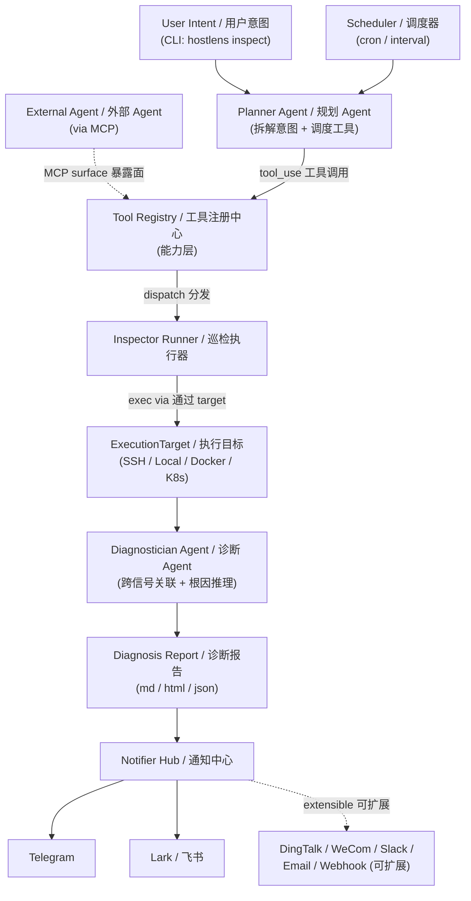

# Hostlens

> **LLM 驱动的服务器巡检 Agent —— 像资深 SRE 一样推理你的基础设施**
>
> *An LLM-powered server inspection agent that reasons about infrastructure like a senior SRE.*

[](https://github.com/HerbertGao/hostlens/actions/workflows/ci.yml)
[](https://www.python.org/)
[](https://www.anthropic.com/)
[](LICENSE)
[](openspec/)

---

## 一句话定位

用自然语言描述你想看什么 —— *「这台机器今早 CPU 持续 80%+，帮我看看怎么回事？」* —— Hostlens 会自动**规划检查项 → 并行采集数据 → 跨指标关联 → 输出带根因假设的结构化报告**。

## 当前状态（必读）

> ⚠️ **设计阶段，无可运行代码** —— 截至当前，仓库只有架构文档（README / CLAUDE.md / TODO.md / docs/ARCHITECTURE.md / docs/OPERABILITY.md / openspec/）。**还没有 PyPI 包、没有 `src/` 代码、没有可执行的 `hostlens` 命令**。
>
> 下面的"快速开始"、"定时巡检"、"MCP Server"等章节展示的是 **目标 UX 与规划中的命令形态**，是为了让架构和路线图有具体的"我们要造什么"的参照系，不是当前可用的功能。
>
> 实现进度按 [TODO.md](TODO.md) 的 M0-M10 路线推进，每期开始前先用 [OpenSpec](openspec/) 起 proposal。

## 为什么需要 Hostlens

传统监控（Zabbix / Prometheus / Nagios）回答的是 *「指标 X 是否超过阈值 Y？」*
Hostlens 回答的是 *「这台主机到底出了什么问题？为什么？」*

|  | 传统监控 | Hostlens |
|---|---|---|
| 触发方式 | 规则命中 | 自然语言意图 |
| 输出形态 | 单指标告警 | 跨信号关联 + 根因假设 |
| 扩展方式 | DSL + 脚本 | 声明式 Inspector 插件 + LLM 编排 |
| 修复能力 | 无 / 外挂 Runbook | 内置 `plan → approve → execute → rollback` 闭环 |
| 交付形态 | Server + Agent | CLI + MCP Server（可被 Claude Code / Cursor 直接调用） |

## 何时用 Hostlens / 何时不用（诚实清单）

Hostlens 是 **Prometheus/Zabbix/Datadog 的补充**，不是替代。把它摆在主告警系统旁边，让前者抓异常告警 + 长期指标，Hostlens 做"出问题时帮我看看到底咋了"的智能诊断助手。

**✅ 优势场景**：

- **临时按需诊断** —— 突发问题"看一眼这台机器怎么了"，传统监控只能告诉你"CPU 高了"，Hostlens 能告诉你"CPU 高是因为某 docker 容器 OOM 重启循环导致 sidecar 持续 retry"
- **定期叙事报告** —— 周报 / 每日巡检，把多个指标关联成可读的叙事而不是一堆图表
- **跨信号根因推理** —— CPU + 磁盘 + 网络 + 日志关联分析，规则匹配做不到
- **新人友好的诊断接口** —— 自然语言意图取代命令记忆
- **声明式扩展检查项** —— 简单巡检（shell 命令 + 表格/JSON 解析）只需一份 YAML；复杂解析逻辑用可选的 `hook.py` 接管（参考 docs/ARCHITECTURE.md §4 复杂示例）

**❌ 劣势场景（请用 Prometheus / Zabbix / Datadog）**：

- **主要告警通道** —— LLM 有延迟（10s~数十秒）+ Anthropic API 依赖 + 输出非确定，不适合做"5xx 突增 30 秒内 page on-call"这种场景
- **指标时序存储 & 长期趋势** —— Hostlens 不存指标，只存离散报告
- **SLO / SLA 强保证** —— 每次巡检结果有自然语言变异性，不适合做 SLO 强制门
- **高频率检查（秒级 / 分钟级）** —— Token 成本 + API rate limit 让秒级巡检不经济
- **完全离线 / 无外网环境** —— Anthropic API 必须可达（除非接本地 LLM，1.0 后才支持）

详细的运维约束、并发预算、密钥与脱敏策略见 [docs/OPERABILITY.md](docs/OPERABILITY.md)。

## 核心特性

- 🧠 **双层 Agent 编排** — Planner Agent 拆解意图、调度 Inspector；Diagnostician Agent 关联多源信号、产出根因假设
- 🔌 **Inspector 插件体系** — 每个检查项是一个声明式 YAML manifest（+ 可选 Python hook），扔进 `inspectors/` 目录 Agent 自动识别
- 🎯 **多目标统一抽象** — SSH / Local / Docker / Kubernetes 统一在 `ExecutionTarget` 接口下
- 🔒 **受控修复（规划中，M9）** — 写操作严格走 `plan → human approve → execute → verify → rollback-ready`，默认只读。**门控前置**：先在 M1-M8 验证只读诊断准确性与可审计性，达标后才解锁修复能力
- 🪄 **CLI + MCP 双交付** — 既是命令行工具（`hostlens inspect ...`），又是 MCP Server（让 Claude Code/Cursor 把它当工具用）
- ⏰ **定时巡检 + 多通道通知** — Cron/Interval 调度，巡检报告自动推送到 Telegram、飞书（Lark），统一 Notifier 接口可平滑扩展钉钉、企业微信、Slack、邮件
- ⚡ **Token 高效** — Prompt caching、Pydantic 结构化输出、增量工具调用全部内置

## 架构

Hostlens 围绕 **双层 Capability Registry** 组织：所有"Agent 可调用的能力"通过统一的 `ToolSpec` 注册（含 policy 元数据），再由 Agent / MCP / CLI 三种 surface 的 adapter 投影出去；业务插件（Inspector / Notifier / ExecutionTarget / Remediation）各自保持独立契约，互不混淆。

### 系统分层架构（自上而下 6 层）

```text
─── L1 · Entry / Delivery · 入口与交付 ───────────────────────────
    CLI (Typer + Rich)         · 命令行（人类入口）
    MCP Server (stdio / HTTP)  · 暴露给外部 LLM
    Scheduler Daemon           · 定时巡检守护进程
                              │
                              v
─── L2 · Agent Layer · 推理与编排 ────────────────────────────────
    Planner / Diagnostician / Remediation Planner   · 三个 Agent
        '----- Agent Loop · Agent 主循环 -----'
        (手写 tool_use + prompt cache + retry + token 预算守护)
                              │  tool_use 工具调用
                              v
─── L3 · Capability Layer · 能力层 (Tool Registry, 2-tier) ───────
    Layer 1: ToolSpec Registry  · 工具规范注册中心
             (host-agnostic 与宿主无关 + policy gate 策略门)
    Layer 2: Agent / MCP / CLI Surface Adapters
             三种表面适配器 (按 surfaces 字段过滤投影)
                              │  dispatch 分发
                              v
─── L4 · Domain Plugin Layer · 业务插件层 (各自独立 Protocol) ────
    Inspector       · 巡检插件 (YAML + 可选 hook.py)
    ExecutionTarget · 执行目标 (Local / SSH / Docker / K8s)
    Notifier        · 通知通道 (TG / Lark / DingTalk / Slack / ...)
    Remediation     · 修复动作 (plan / rollback / verify 三元组)
                              │
                              v
─── L5 · Core Services · 核心服务 (横切关注点) ───────────────────
    Config 配置 | Logging 日志 (structlog+OTel) | Secret Redaction 脱敏
    Report+Run Store 报告与执行存储 (SQLite+zstd) | Schedule Loader 调度加载
                              │
                              v
─── L6 · External Systems · 外部依赖系统 ────────────────────────
    Anthropic API · Claude 模型 | Target Hosts · 目标主机 (SSH/Docker/K8s)
    Notify Channels · 通知服务端 (TG/Lark/DingTalk/Slack/Email/Webhook)
    Secrets · 密钥源 (env / Keychain / SOPS+age)
```

### 端到端数据流（一次 inspection）

节点用 **英文 ID + 中文描述** 双语标注，方便快速理解每个角色。



> 完整架构、所有抽象关系、Tool Registry 双层模型详解、设计决策记录（ADR）、扩展指南详见 **[docs/ARCHITECTURE.md](docs/ARCHITECTURE.md)**。
>
> **关于图的渲染兼容性**：分层图用 ASCII art（任何等宽字体环境都对齐）；数据流图用 mermaid `graph TB` + 双引号 label + `<br/>` 换行（mermaid 8.8.0+ 验证通过），节点 label 内 ASCII 字符与中文都被引号包裹，规避了 8.8 的 `subgraph id ["title"]` 语法限制。

## 技术栈

| 类别 | 选型 | 选型理由 |
|---|---|---|
| 语言 | Python 3.11+（async-first） | 生态最丰富、运维场景天然适配 |
| LLM | Anthropic Claude 原生 SDK | **手写 Agent loop**，不依赖 LangChain，体现底层掌控力 |
| 数据建模 | Pydantic v2 | 全程强类型；structured output 的承载 |
| 远程执行 | AsyncSSH / docker-py / kubernetes | 异步、生产可用 |
| CLI | Typer + Rich | 现代 CLI 体验 |
| MCP | 官方 `mcp` SDK | 让 Claude Code/Cursor 把 Hostlens 当工具 |
| 调度 | APScheduler（cron + interval） | 进程内调度，无需外部 cron |
| 通知 | 统一 `Notifier` 抽象 + 内置 Telegram / 飞书 | 适配器模式，新平台 = 实现一个类 |
| 模板 | Jinja2 | 通知卡片/报告渲染（飞书富文本卡片、Telegram MarkdownV2 等） |
| 测试 | pytest + pytest-asyncio + VCR | LLM 调用走 cassette 回放，可重复 |
| 可观测 | structlog + OpenTelemetry | Agent 调用链可追踪 |

## 快速开始

### LLM 后端选型（先决定用哪个 backend）

Hostlens 模型层走 `LLMBackend` 抽象，支持多种认证方式。详见 [docs/ARCHITECTURE.md §9 模型层](docs/ARCHITECTURE.md#9-agent-loop)。

| Backend | 何时用 | 认证 |
|---|---|---|
| `anthropic_api`（默认） | 个人开发 / 一般生产 | `ANTHROPIC_API_KEY` |
| `bedrock`（路线，M10.5） | **企业生产推荐** —— ToS 干净 + IAM 权限可控 + CloudTrail audit | AWS IAM |
| `vertex`（路线，1.0 后） | GCP 企业 | GCP Service Account |
| `claude_subscription`（experimental） | **dev / demo only**，**禁用于生产 daemon** | Claude Code OAuth |

> ⚠️ `claude_subscription` 注意：Claude.ai 订阅 ToS 明确为「人类交互」设计；用于自动化定时任务可能违反 ToS 且账号有被封风险。daemon 模式启动时会直接 exit 1。详见 ARCHITECTURE §9 ToS 风险表与 [OPERABILITY.md §3.4](docs/OPERABILITY.md)。

### CLI 模式

```bash
pip install hostlens
export ANTHROPIC_API_KEY=sk-ant-...

# 注册一个目标主机（M1 已落地，详见 docs/operations/targets.md）
export HOSTLENS_PROD_PASSWORD=...
hostlens target add prod-web-01 \
  --type ssh \
  --host 1.2.3.4 \
  --user deploy \
  --key-path ~/.ssh/id_ed25519 \
  --password-env HOSTLENS_PROD_PASSWORD

# 验证连通性 + capability 探测
hostlens target test prod-web-01

# 自检环境（参考全局 CLI 范式：doctor 子命令）
hostlens doctor

# 列出已安装 Inspector（M1 落地；builtin 随包发布）
hostlens inspectors list

# 查看单个 Inspector 的 manifest
hostlens inspectors show hello.echo

# 按意图巡检（Agent 自动选 Inspector）
hostlens inspect prod-web-01 --intent "为什么今早 CPU 持续高于 80%？"

# 跑指定 Inspector
hostlens inspect prod-web-01 --inspector linux.cpu.top_processes

# 按 tag 过滤 Inspector
hostlens inspectors list --tag linux

# 输出 HTML 报告
hostlens inspect prod-web-01 --intent "..." --output report.html
```

### 定时巡检 + 通知

用一份 YAML 描述「巡检谁、跑什么、推给谁、什么时候跑」：

```yaml
# schedules/daily-prod-health.yaml
name: daily-prod-health
schedule:
  cron: "0 9 * * *"          # 每天 9 点
  timezone: Asia/Shanghai
targets: [prod-web-01, prod-web-02, prod-db-01]
intent: "做一次日常健康巡检，重点看 CPU/内存/磁盘/关键服务"   # 必填; Planner Agent 据此规划
inspectors:                    # 可选 hint; 给定时 Planner 优先考虑这个集合, 仍可按需要补查其他
  - linux.cpu.top_processes
  - linux.disk.usage
  - linux.memory.pressure
  - nginx.health
report:
  format: lark_card            # markdown / html / json / lark_card / tg_md
  diff_with_last: true         # 与上次报告做 regression diff
notify:
  - channel: lark_ops_group
    only_if: "has_findings(severity >= 'warning')"
  - channel: tg_oncall
    only_if: "has_findings(severity >= 'critical')"
```

通道在全局配置一次：

```yaml
# ~/.config/hostlens/notifiers.yaml
channels:
  lark_ops_group:
    type: lark
    webhook: https://open.feishu.cn/open-apis/bot/v2/hook/xxx
    secret: ${LARK_SIGN_SECRET}    # 支持环境变量
  tg_oncall:
    type: telegram
    bot_token: ${TG_BOT_TOKEN}
    chat_id: -1001234567890
  # 未来扩展：把 type 改成 dingtalk / wecom / slack / email / webhook 即可
```

启动调度器：

```bash
hostlens schedule run            # 前台运行，开发用
hostlens schedule daemon         # 后台 daemon
hostlens schedule list           # 查看所有定时任务及下次触发时间
hostlens schedule trigger daily-prod-health   # 手动触发一次

# 单次发送（不走调度，做测试用）
hostlens notify lark_ops_group --report report.json
```

### MCP Server 模式

```bash
hostlens mcp serve --stdio        # 给 Claude Code / Cursor 用
hostlens mcp serve --http --port 8765   # 给远程 Agent 用
```

接入 Claude Code（`~/.claude.json`）：

```json
{
  "mcpServers": {
    "hostlens": {
      "command": "hostlens",
      "args": ["mcp", "serve", "--stdio"]
    }
  }
}
```

## 编写一个 Inspector

**简单巡检**只需要一份 YAML manifest（shell 命令 + 表格/JSON 解析 + simpleeval 表达式判定）；**复杂场景**（多命令关联、原始文本解析、SQL 查询、TLS 探测等）在同目录加一个 `hook.py` 用 Python 接管解析与判定 —— 见 [docs/ARCHITECTURE.md §4 复杂示例](docs/ARCHITECTURE.md#4-inspector-插件体系)。

最小例子（纯 YAML）：

```yaml
# inspectors/linux/cpu/top_processes.yaml
name: linux.cpu.top_processes
version: 1.0.0
description: 找出 CPU 占用最高的进程
tags: [linux, cpu, performance]
targets: [ssh, local]

collect:
  command: ps -eo pid,user,%cpu,%mem,comm --sort=-%cpu | head -20
  timeout_seconds: 10

parse:
  format: table
  columns: [pid, user, cpu_pct, mem_pct, command]

output_schema:
  type: object
  properties:
    processes:
      type: array
      items:
        type: object
        properties:
          pid: { type: integer }
          cpu_pct: { type: number }
          command: { type: string }

findings:
  - for_each: "processes as p"          # 遍历 processes 数组, 绑定每行为 p
    when: "p.cpu_pct > 70"              # 表达式真时为每行生成一个 finding
    severity: warning
    message: "进程 {p.command} (pid={p.pid}) 占用 {p.cpu_pct}% CPU"
```

复杂逻辑可以选配同目录 `hook.py`，用 Python 接管解析/判定。

## 测试与覆盖率

跑本地完整测试管线（M0 阶段）：

```bash
pip install -e ".[dev]"
pytest --cov=hostlens --cov-report=term
pre-commit run --all-files
mypy --strict src/
```

**Coverage policy（M0 透明声明）**：M0 阶段 `pytest --cov` 仅生成覆盖率报告但**不设强制门槛**——目前测试集主要覆盖脚手架与 doctor，门槛此刻定低无意义、定高反而误导；**M2 引入 Agent loop 后会引入 80% 覆盖率门槛**（届时 Agent 行为逻辑足够丰富，覆盖率指标才有约束力）。

## 路线图

- [ ] Inspector 插件加载器与注册中心
- [ ] ExecutionTarget 抽象 + SSH/Local 实现
- [ ] Planner Agent（基于 Anthropic SDK 的手写 tool-use loop）
- [ ] 内置 Inspector 集（Linux 系统、Nginx、MySQL、Redis、Docker、K8s）
- [ ] Diagnostician Agent + 关联规则
- [ ] CLI（target / inspect / inspectors / doctor / schedule / notify / mcp）
- [ ] MCP Server（stdio + HTTP）
- [ ] Docker / Kubernetes ExecutionTarget
- [ ] Scheduler（APScheduler cron + interval + daemon）
- [ ] Notifier 抽象 + 内置 Telegram / 飞书 Lark 适配器
- [ ] 报告渲染（Markdown / HTML / JSON / 飞书富文本卡片 / Telegram MarkdownV2）
- [ ] Regression diff：与上次巡检报告的对比
- [ ] Remediation 工作流（plan → approve → execute → rollback）
- [ ] 通道扩展：钉钉、企业微信、Slack、Email、通用 Webhook
- [ ] 1.0 之后：Web Dashboard、Inspector 市场

## 设计原则

详见 [`CLAUDE.md`](CLAUDE.md) 中的项目设计约定，简要：

1. **Agent loop 必须手写**，不引入 LangChain —— 这是项目核心展示点
2. **Inspector 是 SOT**，Agent 只做调度与推理 —— 新增检查项等于加一个 YAML
3. **写操作的硬约束**：默认 dry-run，必须显式审批，必须有回滚预案
4. **Prompt caching 是必修**，不是优化项
5. **架构清晰度 > 功能广度 > 性能极致**

## License

Apache-2.0
