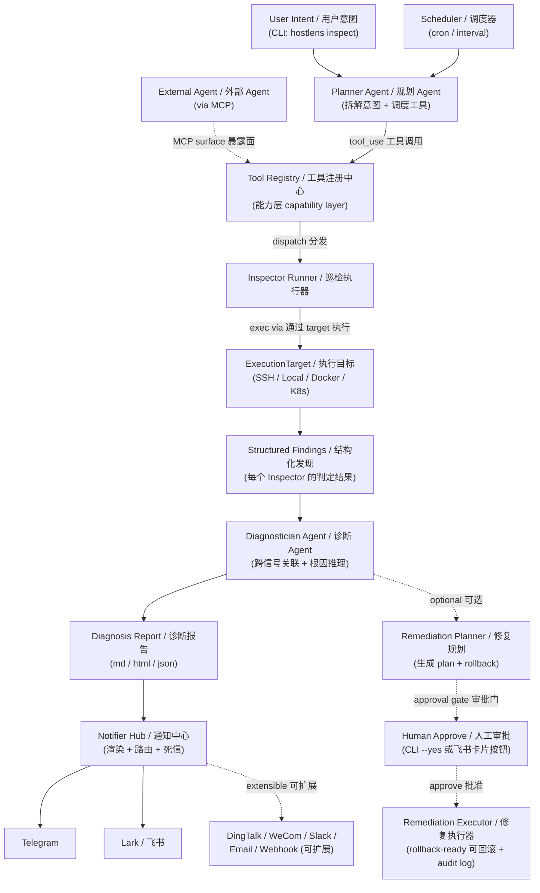
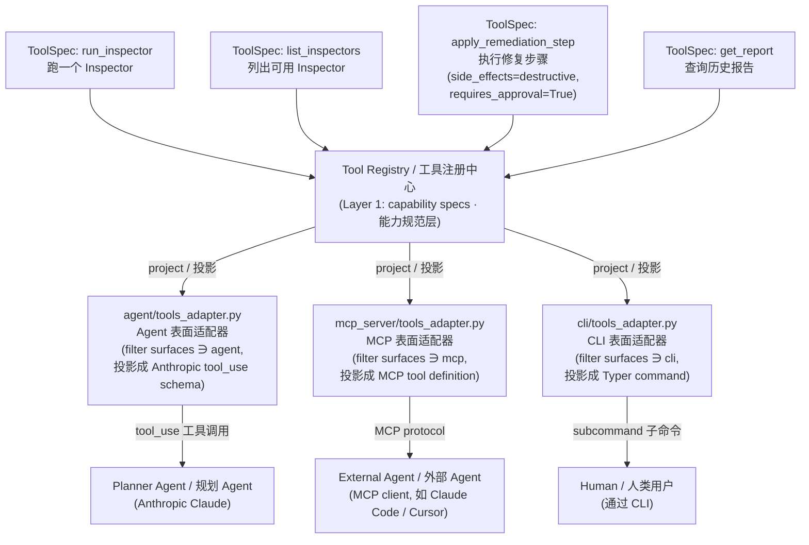

# Hostlens 架构文档

> 项目的完整架构、抽象关系、设计决策记录与扩展指南。
>
> 所有图均使用 **mermaid 8.8.0 兼容语法**（`graph` 关键字、双引号 label、纯 ASCII、无 HTML/emoji），
> 在 GitHub、Typora、VS Code Markdown Preview Enhanced 等老版本渲染环境下都能正常显示。

---

## 1. 系统视图

Hostlens 是一个 **Python CLI + 长驻 Daemon + 可嵌入 MCP Server** 的混合形态服务。本节给出两张互补的图：

- **§1.1 系统分层架构** —— 按职责分层的"系统架构图"，看清楚组件如何堆叠、依赖如何流向
- **§1.2 数据流（端到端）** —— 一次 inspection 的纵向流水，看清楚一次诊断如何走完管线

### 1.1 系统分层架构

Hostlens 按职责自上而下分 6 层。上层调用下层；同层组件平行；越层调用是例外（如 CLI 不经 Agent 直 dispatch 简单 read-only 工具时）。

> 下图用 ASCII art 而非 mermaid，因 mermaid 8.8.0 不支持 `subgraph id ["title"]` 语法（8.13+ 才加）。采用开放式横线分隔（无闭合 box），中文与英文混排不影响布局；在任何等宽字体环境下都稳。

```text
─── L1 · Entry / Delivery · 入口与交付 ───────────────────────────────
    CLI (Typer + Rich)         · 命令行（人类入口）
    MCP Server (stdio / HTTP)  · 暴露给外部 LLM / Claude Code
    Scheduler Daemon           · 定时巡检守护进程
                              │
                              v
─── L2 · Agent Layer · 推理与编排 ────────────────────────────────────
    Planner Agent              · 规划：拆解意图 → 选 Inspector → 并行调度
    Diagnostician Agent        · 诊断：跨信号关联 + 根因推理
    Remediation Planner Agent  · 修复规划：生成 plan + rollback 步骤
        '----- Agent Loop · Agent 主循环 -----'
        (手写 tool_use + prompt cache + retry + token 预算 + max turn 兜底)
                              │  tool_use · 工具调用
                              v
─── L3 · Capability Layer · 能力层 (Tool Registry, 2-tier 双层) ──────
    Layer 1:  ToolSpec Registry · 工具规范注册中心
              (host-agnostic 与宿主无关 + policy metadata 策略元数据)
                              │  project via · 投影到具体表面
                              v
    Layer 2:  [ Agent Adapter ]  [ MCP Adapter ]  [ CLI Adapter ]
              三种 Surface Adapter · 表面适配器（按 surfaces 字段过滤）
                              │  dispatch · 分发执行
                              v
─── L4 · Domain Plugin Layer · 业务插件层 (各自独立 Protocol; 不共基类) ─
    Inspector Plugins      · 巡检插件 (YAML manifest + 可选 hook.py)
    ExecutionTarget        · 执行目标 (Local / SSH / Docker / K8s)
    Notifier Adapters      · 通知通道 (TG / Lark / DingTalk / Slack / ...)
    Remediation Library    · 修复动作库 (plan / rollback / verify 三元组)
                              │
                              v
─── L5 · Core Services · 核心服务 (cross-cutting 横切关注点) ─────────
    Config / Settings      · 配置（pydantic-settings + yaml）
    Logging                · 日志（structlog + OpenTelemetry 链路追踪）
    Secret Redaction       · 密钥脱敏（统一过滤后才能写日志/报告）
    Report + Run Store     · 报告与执行存储（SQLite + zstd 压缩）
    Schedule Loader        · 调度加载器（schedules/*.yaml）
                              │
                              v
─── L6 · External Systems · 外部依赖系统 ─────────────────────────────
    Anthropic Claude API   · LLM 调用（Agent 推理的算力来源）
    Target Hosts           · 目标主机（SSH / Docker / K8s API）
    Notify Channels        · 通知服务端（TG Bot / Lark Webhook / ...）
    Secrets Sources        · 密钥来源（env / Keychain / SOPS+age）
```

**读图要点**：

1. **L4 四个业务插件互不继承共同基类** —— Inspector / ExecutionTarget / Notifier / Remediation 各有独立 Protocol，契约根本不同（参考 ADR-003）
2. **L3 能力层只管 Agent 可主动调用的能力** —— **Notifier 不在 Tool Registry 里**，它是 Scheduler 在报告产出后触发的输出通道（参考 ADR-004）
3. **越层调用是例外，不是默认** —— CLI 可以直接 dispatch 简单 read-only ToolSpec（如 `hostlens inspectors list`），不必走 Agent loop；Agent loop **通过 `LLMBackend` Protocol（§9 模型层 / ADR-008）** 调外部 LLM 服务 —— L2 跟 L6 之间通过 Backend 抽象建立连接，Agent loop 不直接 import `anthropic`
4. **L5 核心服务是横切关注点** —— 不依赖业务插件，被所有层引用；Config / Logging / Redact / Store / Scheduler 都在这里
5. **L6 是唯一与外网/远端交互层** —— 所有外部 IO 都汇聚于此，方便统一打点、限流、配额控制

### 1.2 数据流（一次 inspection 的端到端）

下图展示一次完整诊断的纵向流水：从用户意图到报告推送，附受控修复分支。节点用 **英文 ID + 中文描述** 双语标注。



**读图要点**：

- **三个触发入口**（CLI / Scheduler / 外部 MCP Agent）都汇聚到 Planner Agent；MCP 入口走 Tool Registry 投影路径，CLI / Scheduler 走 Agent loop 路径
- **诊断阶段是只读** —— Inspector Runner → ExecutionTarget → Findings → Diagnostician → Report，全程不修改远端状态
- **报告产出后由 Scheduler / Reporter 触发 Notifier**（不是 Agent 主动调用），多通道并行发送、单通道失败不阻塞其他
- **受控修复是独立路径**（虚线分支），必须经过 Human Approve gate，从不自动执行（参考 ADR-006）

---

## 2. 关键抽象一览

| 抽象                       | 类型                                | 谁实例化                       | 谁调用                                | 职责                                          |
| -------------------------- | ----------------------------------- | ------------------------------ | ------------------------------------- | --------------------------------------------- |
| **Inspector**        | 业务插件（YAML + 可选 Python hook） | YAML manifest 自动加载         | Inspector Runner                      | 采集 + 解析 + 结构化判定，输出 Findings       |
| **ExecutionTarget**  | Protocol 实现                       | CLI `target add` 注册        | Inspector Runner                      | 在远端/本地/容器/Pod 执行命令                 |
| **ToolSpec**         | Pydantic 模型                       | `@tool` 装饰器注册           | Agent loop / MCP server / CLI adapter | 声明一个 Agent 可调用能力（含 policy 元数据） |
| **Notifier**         | Protocol 适配器                     | `notifiers.yaml` 配置实例化  | Scheduler / Reporter                  | 渲染报告 + 推送到一个通道                     |
| **Schedule**         | YAML manifest                       | `schedules/*.yaml` 自动加载  | APScheduler runner                    | 定义"何时、对谁、跑什么、推给谁"              |
| **Remediation Step** | Pydantic 模型                       | Remediation Planner Agent 生成 | Remediation Executor                  | 一个 forward/rollback/verify 三元组           |
| **Report**           | Pydantic 模型 + SQLite 持久化       | Diagnostician 生成             | 渲染器 / Notifier / Regression diff   | 一次巡检的完整结果                            |

**清晰的职责分层**：

- **业务插件层**（Inspector / Notifier / ExecutionTarget / Remediation Action）—— 各自有独立的 Protocol 与 registry，**互不混淆，互不继承共同基类**
- **能力层**（Tool Registry）—— 把"Agent 可调用的能力"统一注册，但不替代上面的业务插件
- **Agent 层**（Planner / Diagnostician / Remediation Planner）—— 只跟 Tool Registry 对话，不感知工具底层来源
- **交付层**（CLI / MCP Server / Scheduler）—— 是触发入口与输出适配器，不持有业务逻辑

---

## 3. Tool Registry —— 双层 Capability 模型

> 这是 Hostlens 架构的核心抽象，也是项目区别于"另一个 LangChain wrapper"的关键设计。

### 为什么不是「让所有插件继承一个 BaseRegistry」

Inspector 的契约是 `collect/parse/findings`，Notifier 的契约是 `render/send/validate`，ExecutionTarget 的契约是 `exec/capabilities`。**强行抽一个共同父类只能提供 name lookup，得到的 `Any` 类型会稀释整个项目的类型安全**。所以这四类业务插件保持各自独立的 registry。

### 为什么需要 Tool Registry

但 Agent loop（Anthropic tool_use）和 MCP Server（暴露给外部 Agent）需要看到一个**统一的能力列表**。如果不抽，会变成：

- Agent loop 里写一坨 `if tool_name == "run_inspector": ...`
- MCP server 里把同样的逻辑再实现一遍
- CLI 里如果想暴露同样的能力，再实现第三遍

所以抽 Tool Registry，**只把"Agent 主动调用的能力"统一管理**，业务插件的契约不动。

### Layer 1 — Capability Spec（host-agnostic）

```python
class ToolSpec(BaseModel):
    name: str
    version: str
    input_schema: type[BaseModel]      # Pydantic; JSON Schema 由 adapter 在投影时生成
    output_schema: type[BaseModel]
    handler: Callable[[BaseModel, ToolContext], Awaitable[BaseModel]]

    # 三个 surface 文案分开 (CLI 给人 / Agent 给本地 LLM / MCP 给远程 LLM, 人因诉求不同)
    agent_description: str
    mcp_description: str
    cli_help: str | None               # None = 不暴露 CLI

    # 策略元数据 (policy gate, 不是 hint)
    surfaces: set[Literal["agent", "mcp", "cli"]]
    side_effects: Literal["none", "read", "write", "destructive"]
    requires_approval: bool = False
    permissions: set[str] = set()
    sensitive_output: bool | None = None      # 必须显式声明; adapter 在 MCP 投影时拒绝 None
    target_constraints: set[str] | None = None
    timeout: float | None = None
    tags: set[str] = set()
```

> **关于 `sensitive_output` 的默认值**：刻意用 `None` 而不是 `False`。理由：`False` 默认会让"忘记声明"和"显式声明无敏感输出"无法区分，破坏 MCP policy gate 的"不显式即拒绝"语义。每个 ToolSpec 必须由作者主动决定是否敏感。

### Layer 2 — Surface Adapters



### 依赖注入（强制）

Handler 不允许从 module-level singleton 拿依赖，必须通过 `ToolContext`：

```python
@dataclass(frozen=True)
class ToolContext:
    target_registry: TargetRegistry
    inspector_registry: InspectorRegistry
    config: Settings
    logger: structlog.BoundLogger
    approval_service: ApprovalService
    cancel: asyncio.Event

@tool(
    name="run_inspector",
    surfaces={"agent", "mcp"},
    side_effects="read",
)
async def run_inspector(args: RunInspectorInput, ctx: ToolContext) -> InspectorResult:
    target = ctx.target_registry.get(args.target_name)
    inspector = ctx.inspector_registry.get(args.inspector_name)
    return await inspector.run(target, ctx.cancel)
```

### 6 条硬规则

1. `surfaces` 是 policy gate 不是 hint —— 多注册一个 surface = 一次显式安全决定
2. `ToolSpec` 不存 host 专有 JSON Schema —— 由 adapter 在投影时从 Pydantic 生成
3. 新增 Agent 可调用能力必须声明为 `ToolSpec`：`@tool` 只能作为纯 spec factory 包装 handler 并返回 `ToolSpec`，不得 mutate module-level/global registry；默认工具集必须通过 `register_default_tools(registry)` 之类的显式装配函数注册到具体 `ToolRegistry` 实例；不允许在 prompt 里写死能力或绕过 registry 直调函数
4. **Notifier 不进 Tool Registry** —— 它是 Scheduler/Reporter 触发的输出通道，不是 Agent 主动调用的能力
5. 危险操作必须 `side_effects in {write, destructive}` 且 `requires_approval=True`，adapter 在 dispatch 前强制校验
6. MCP 暴露的工具必须显式声明 `sensitive_output`，缺省禁止暴露

### 实战场景：Policy Gate 防止意外暴露

举一个具体的 before/after，说明为什么 `surfaces` 必须是 policy gate 而非 hint：

**场景**：M9 实现"清理过期 docker 镜像"工具时，本意是允许 CLI 直接调用、Agent 也能在审批后用，但**不想让远程 MCP 客户端在没有审批信号的情况下调用**。

```python
@tool(
    name="docker_prune_images",
    version="1.0.0",
    input_schema=PruneImagesInput,
    output_schema=PruneImagesResult,
    handler=docker_prune_images_handler,

    agent_description="Remove dangling docker images older than N days. Requires approval.",
    mcp_description="Not exposed via MCP.",
    cli_help="Prune dangling docker images on a target.",

    surfaces={"agent", "cli"},               # policy gate: 没有 "mcp"
    side_effects="destructive",
    requires_approval=True,
    permissions={"docker.images.delete"},
    sensitive_output=False,
)
```

**MCP adapter 在投影时强制校验**：

```python
def project_to_mcp(spec: ToolSpec) -> MCPToolDefinition | None:
    if "mcp" not in spec.surfaces:
        return None                           # 直接不暴露
    if spec.side_effects == "destructive" and not spec.requires_approval:
        raise PolicyError(f"{spec.name}: destructive tool without requires_approval cannot be MCP-exposed")
    if spec.sensitive_output is None:
        raise PolicyError(f"{spec.name}: sensitive_output must be explicitly declared for MCP")
    return MCPToolDefinition(...)
```

**对比"软分类"反例**：如果 `surfaces` 只是个 hint（例如一个字符串 list 用来标记），有人想加 MCP 暴露时只需要在 list 里加 `"mcp"`，没有任何 gate 提醒 ta "你正在把一个 destructive 工具暴露给远程客户端"。policy gate 把每一个 surface 决定都变成"必须经过 adapter 校验的显式动作"。

### 实施节奏

- **M2（已落地）**：实现 Layer 1（ToolSpec + Registry + ToolContext）+ Agent surface adapter；MCP 与 CLI adapter 暂不实现
- **M7（已落地）**：`mcp_server/{tools_adapter.py, server.py}` —— `McpToolsAdapter.list_for_mcp()` / `dispatch()` 投影 `surfaces ∋ "mcp"` 的 ToolSpec，强制校验 `sensitive_output` 与 `requires_approval`；`build_server` + `run_stdio` stdio server；`hostlens mcp serve` CLI；只读三件套（`list_inspectors` / `list_targets` / `run_inspector`）显式 opt-in mcp surface；`hostlens doctor --json` 的 `checks.mcp`（`ok` / `missing`，非致命）；fail-closed 三处对称（`list_for_mcp` 投影 / `build_server` eager 自检 / `dispatch` 门）；**stdio-only**（HTTP transport 为 Non-Goal，见 `add-mcp-server-surface` proposal）
- **未定**：CLI surface adapter 是否需要 —— 默认 CLI 命令仍由 Typer 直接写，只有"想让人类直接调用一个 Agent 能力"时才走 cli_adapter

---

## 4. Inspector 插件体系

> **M1 落地（PR 待定）**：`InspectorManifest` Pydantic schema、loader（含 shell 注入静态校验五件套）、`InspectorRegistry`（含 builtin + 用户目录搜索）、`InspectorRunner`（4 种 parse format + Finding DSL 求值引擎 + 6 步 preflight + 5 种闭集 `InspectorStatus`）、2 个内置 Inspector（`hello.echo` / `system.uptime`）、`hostlens inspectors list/show` CLI、`hostlens doctor` 的 `inspectors` section 全部落地于 OpenSpec 提案 [`add-inspector-plugin-system`](../openspec/changes/add-inspector-plugin-system/)。Finding DSL 在 simpleeval 上注册 `len/sum/min/max/any/all/now/float/int`（`float`/`int` 是 `system.uptime` 阈值比较所需的类型转换函数）。
>
> **M1 范围**（严格子集，写在 manifest 内多余字段会被 loader `extra="forbid"` 拒绝）：
>
> - manifest 加载（`yaml.safe_load` + 256 KB 上限 + Pydantic v2 严格字段集）
> - 4 种 `parse.format`：`raw` / `table` / `json` / `kv`
> - Finding DSL（`for_each` / `when` / `severity` / `message` 四字段；simpleeval 已注册 `float` / `int`）
> - Runner 求值顺序固定为 preflight → render → exec → parse → schema → findings；6 步 preflight；5 种 `InspectorStatus` 闭集：`ok` / `timeout` / `target_unreachable` / `requires_unmet` / `exception`
> - `hostlens inspectors list/show` CLI（只读，允许 root）
> - 2 个内置 Inspector（`hello.echo` / `system.uptime`），随包发布
>
> **M1 明确不在范围**（写了 loader 直接 raise，留给后续提案）：
>
> - `hook.py` Python 扩展 —— 留给未来独立提案的复杂场景（TLS expiry 等逃生舱）
> - `parse.format: sql_result` —— **未实现**，本期不引入（M6 PostgreSQL Inspector 经验证可纯 YAML 写出，superseded by《Inspector 作者契约》）
> - `collect.sampling_window` —— 留给 M2.8 incident pack 的 `log.tail.error_burst` Inspector
> - `artifacts` —— 留给 M3 报告系统（依赖 Report 数据模型支持 attachment）
> - `hostlens inspect <target> --inspector <name>` 端到端命令 —— 依赖 Report 数据模型，留给下一提案 `add-report-data-model`
>
> 实现细节与 manifest 字段速查另见 [docs/operations/inspectors.md](operations/inspectors.md)；写作教程见 [docs/operations/inspector-authoring.md](operations/inspector-authoring.md)。

### 设计目标

新增一个巡检项 = **加一个 YAML 文件**，零 Python 代码（复杂场景才上 hook.py）。

### Manifest 结构（扩展版，覆盖真实运维需求）

Inspector manifest 必须支持参数化、远端依赖检查、密钥引用、特权声明、时窗采集。简单场景下大多数字段可省略。

```yaml
# 基础示例：纯 shell 采集 + 表格解析
name: linux.cpu.top_processes        # 全局唯一命名空间
version: 1.0.0
description: Identify top CPU-consuming processes
tags: [linux, cpu, performance]

# 兼容性声明
targets: [ssh, local]                 # 兼容的 ExecutionTarget 类型
requires_capabilities: []             # 此 Inspector 需要的 target capability (空 = 无要求)
requires_binaries: [ps]               # 远端必须存在的二进制；缺失时自动 skip 并报告
privilege: none                       # none / sudo / root；非 none 时必须显式 opt-in

collect:
  command: ps -eo pid,user,%cpu,%mem,comm --sort=-%cpu | head -20
  timeout_seconds: 10

parse:
  format: table                       # raw / table / json / kv
  columns: [pid, user, cpu_pct, mem_pct, command]

output_schema:                        # JSON Schema
  type: object
  properties:
    processes:
      type: array
      items:
        type: object
        properties:
          pid: { type: integer }
          cpu_pct: { type: number }

findings:                             # 见下方「Finding DSL」小节
  - for_each: "processes as p"        # 遍历 output 中 processes 数组，绑定 p
    when: "p.cpu_pct > 70"            # simpleeval 表达式; true 时为每行产生一个 finding
    severity: warning
    message: "Process {p.command} (pid {p.pid}) consuming {p.cpu_pct}% CPU"
```

### Finding DSL 求值语义

**规则**：

| 字段         | 是否必填 | 说明                                                                                                                                                                  |
| ------------ | -------- | --------------------------------------------------------------------------------------------------------------------------------------------------------------------- |
| `for_each` | 否       | 形如 `<expr> as <var>`。`<expr>` 是 simpleeval 表达式（计算结果必须是可迭代）；`<var>` 是绑定到当次迭代行的变量名。**省略 = 聚合规则（不迭代）**          |
| `when`     | 是       | simpleeval 表达式。**有 `for_each` 时**对每行求值（变量名见绑定）；**无 `for_each` 时**在 output 顶层求一次。结果必须为 bool                          |
| `severity` | 是       | `info` / `warning` / `critical`                                                                                                                                 |
| `message`  | 是       | Python `.format(...)` 风格模板。**有 `for_each` 时**可引用绑定变量（如 `{p.command}`）；**无 `for_each` 时**只能引用 output 顶层字段与 parameters |

**求值上下文**（无论哪种）：

- `output` 中所有顶层字段（如 `processes` / `endpoints` / `tables`）
- `parameters` 中所有字段（如 `warn_days` / `bloat_pct_warn`）
- 注入的运行时变量：`window_start` / `window_end`（time-windowed inspector 时）
- 内置只读函数：`len(x)` / `sum(x)` / `min(x)` / `max(x)` / `any(x)` / `all(x)` / `now()`

**两种模式对比**：

```yaml
# 遍历模式: 每个触发行生成一个 finding
- for_each: "processes as p"
  when: "p.cpu_pct > 70"
  severity: warning
  message: "Process {p.command} (pid {p.pid}) consuming {p.cpu_pct}% CPU"

# 聚合模式: 整个 output 产生 0 或 1 个 finding
- when: "len(processes) == 0"
  severity: critical
  message: "ps returned no processes - target may be unhealthy"
```

**禁止**：聚合模式的 `message` 内引用任何 `for_each` 变量。loader 校验时直接拒绝。

### 复杂示例 1：参数化 + 无密钥（TLS 证书过期）

```yaml
name: net.tls.cert_expiry
version: 1.0.0
description: Check TLS certificate expiry for configured endpoints
tags: [network, tls, security]
targets: [local, ssh]
requires_binaries: [openssl]

parameters:                           # 由 schedule manifest 或 CLI 传入
  type: object
  required: [endpoints]
  properties:
    endpoints:
      type: array
      items: { type: string, pattern: "^[a-zA-Z0-9.-]+:\\d+$" }
    warn_days: { type: integer, default: 30 }
    critical_days: { type: integer, default: 7 }

collect:
  command: |                          # collect.command 支持 Jinja2 (吃 parameters / secrets)
    for ep in {{ endpoints | map('sh') | join(' ') }}; do      # 每个 endpoint 先 shellquote 再 join
      host=$(echo $ep | cut -d: -f1)
      port=$(echo $ep | cut -d: -f2)
      echo "---ENDPOINT $ep---"
      echo | openssl s_client -servername $host -connect $ep 2>/dev/null \
        | openssl x509 -noout -enddate -subject
    done
  timeout_seconds: 30

parse:
  format: raw                         # raw 时由可选 hook.py 自定义解析

output_schema:
  type: object
  properties:
    endpoints:
      type: array
      items:
        type: object
        properties:
          endpoint: { type: string }
          days_until_expiry: { type: integer }

findings:
  - for_each: "endpoints as e"
    when: "e.days_until_expiry <= critical_days"
    severity: critical
    message: "TLS cert for {e.endpoint} expires in {e.days_until_expiry} days"
  - for_each: "endpoints as e"
    when: "e.days_until_expiry <= warn_days and e.days_until_expiry > critical_days"
    severity: warning
    message: "TLS cert for {e.endpoint} expires soon ({e.days_until_expiry} days)"
```

### 复杂示例 2：密钥引用 + 真实 SQL（PostgreSQL 表 bloat）

```yaml
name: postgres.bloat_tables
version: 1.0.0
description: Identify bloated PostgreSQL tables using pg_stat_user_tables
tags: [postgres, db, performance]
targets: [ssh]
requires_binaries: [psql]

parameters:
  type: object
  required: [host, port, database, user]
  properties:
    # 所有 string 类型字段必须声明 pattern 约束字符集 (loader 强制要求, 防注入)
    host:     { type: string, pattern: "^[a-zA-Z0-9.\\-]+$" }
    port:     { type: integer, minimum: 1, maximum: 65535, default: 5432 }
    database: { type: string, pattern: "^[a-zA-Z0-9_\\-]+$" }
    user:     { type: string, pattern: "^[a-zA-Z0-9_\\-]+$" }
    bloat_pct_warn:     { type: number, default: 20 }
    bloat_pct_critical: { type: number, default: 50 }

secrets:                              # secrets 走 HOSTLENS_ 前缀声明, collector remap 到原生 $PGPASSWORD, 严禁 Jinja 插值
  - HOSTLENS_POSTGRES_PASSWORD

collect:
  # 安全规则: secrets 走 $VAR (runner 注入 env), parameters 走 `| sh` filter 强制 shellquote
  command: |
    psql -h {{ host | sh }} -p {{ port }} -U {{ user | sh }} \
        -d {{ database | sh }} -At -F'|' -c "
      SELECT schemaname || '.' || relname AS table,
             pg_size_pretty(pg_total_relation_size(relid)) AS size,
             n_dead_tup,
             n_live_tup,
             CASE WHEN n_live_tup > 0
                  THEN round(100.0 * n_dead_tup / n_live_tup, 2)
                  ELSE 0 END AS bloat_pct
      FROM pg_stat_user_tables
      WHERE n_dead_tup > 1000
      ORDER BY n_dead_tup DESC
      LIMIT 20;
    "
  timeout_seconds: 30

parse:
  # 注：早期草案用过虚构的 format: sql_result，该 format 未实现、本期不引入；
  # superseded by《Inspector 作者契约》—— psql 的 -At -F'|' 输出按 | 分隔，
  # 可直接走 format: table（delimiter 化）纯 YAML 解析，无需新 parse format。
  format: table
  columns: [table, size, n_dead_tup, n_live_tup, bloat_pct]

output_schema:
  type: object
  properties:
    tables:
      type: array
      items:
        type: object
        properties:
          table: { type: string }
          bloat_pct: { type: number }

findings:
  - for_each: "tables as t"
    when: "t.bloat_pct >= bloat_pct_critical"
    severity: critical
    message: "Table {t.table} bloat {t.bloat_pct}% (dead/live ratio)"
  - for_each: "tables as t"
    when: "t.bloat_pct >= bloat_pct_warn and t.bloat_pct < bloat_pct_critical"
    severity: warning
    message: "Table {t.table} bloat {t.bloat_pct}%"
```

### Manifest 字段速查

| 字段                        | 必填 | 说明                                                                                                                                         |
| --------------------------- | ---- | -------------------------------------------------------------------------------------------------------------------------------------------- |
| `name`                    | ✓   | 全局唯一，建议 `<domain>.<subdomain>.<check>`                                                                                              |
| `version`                 | ✓   | semver；output_schema 变更必须 bump                                                                                                          |
| `description`             | ✓   | 一句话说明检查目的                                                                                                                           |
| `tags`                    |      | 用于 `inspectors list --tag` 与 Planner Agent 选择                                                                                         |
| `targets`                 | ✓   | 兼容的 target type 列表                                                                                                                      |
| `requires_capabilities`   |      | target 必须具备的 Capability（如 SYSTEMD / DOCKER_CLI）                                                                                      |
| `requires_binaries`       |      | 远端必须存在的可执行文件；缺失自动 skip 并在报告标记 `requires_unmet`                                                                      |
| `privilege`               |      | `none` / `sudo` / `root`；非 none 时必须 schedule manifest 或 CLI 显式 opt-in                                                          |
| `parameters`              |      | JSON Schema；由 schedule manifest / CLI 传入；collect.command 可通过 Jinja2 引用                                                             |
| `secrets`                 |      | 引用的 `${ENV_VAR}` 名字列表；doctor 校验存在；不出现在日志/报告/Notifier payload                                                          |
| `collect.command`         | ✓   | shell 命令（可 Jinja2 模板）；通过 ExecutionTarget 执行                                                                                      |
| `collect.timeout_seconds` |      | 默认 60s                                                                                                                                     |
| `collect.sampling_window` |      | 时窗采集，Runner 注入 `{{ window_start }}` / `{{ window_end }}`                                                                          |
| `parse.format`            | ✓   | raw / table / json / kv                                                                                                                       |
| `parse.columns`           |      | table 必填                                                                                                                                    |
| `output_schema`           | ✓   | JSON Schema；用于校验 parse 结果与 LLM 引用                                                                                                  |
| `findings`                | ✓   | DSL 列表；每条含 `for_each`（可选）/ `when`（必填，simpleeval 布尔表达式）/ `severity` / `message`。详见前述「Finding DSL 求值语义」 |
| `artifacts`               |      | 额外产物声明（例如"附上最近 50 行 nginx error.log 给报告"）                                                                                  |

### 执行流程

```mermaid
graph LR
    yaml["inspectors/*.yaml<br/>清单文件"]
    loader["Inspector Loader<br/>加载器 (校验 manifest)"]
    reg["Inspector Registry<br/>注册中心"]
    runner["Inspector Runner<br/>执行器"]
    target["ExecutionTarget<br/>执行目标"]
    parser["Parser / 解析器<br/>(table / json / kv)"]
    fmatcher["Findings Matcher / 判定匹配器<br/>(simpleeval 表达式求值)"]
    result["InspectorResult<br/>巡检结果 (含 findings)"]

    yaml -->|"load 加载"| loader
    loader -->|"register 注册"| reg
    reg -->|"lookup 查找"| runner
    runner -->|"exec collect.command<br/>执行采集命令"| target
    target -->|"raw stdout<br/>原始输出"| parser
    parser -->|"structured data<br/>结构化数据"| fmatcher
    fmatcher -->|"emit 产出"| result
```



### 安全边界

**Findings 表达式**：

- `findings[].when` 表达式用 `simpleeval`（不是 `eval`），**只允许只读表达式**；`for_each` 中的 `<expr>` 也是 simpleeval 表达式
- Inspector **不能调 LLM** —— 推理留给 Agent

**命令渲染（防 shell 注入与 secret 泄漏）**：

- `collect.command` 通过 ExecutionTarget 执行（shell-evaluated），**Inspector 自身无法绕过 target 拿到任意 shell**
- **Secrets 永远走环境变量，不内联进命令字符串**：runner 把 manifest 声明的 `secrets:` 解析后通过 `ExecutionTarget.exec(cmd, *, env={...})` 注入，命令中通过 `$VAR_NAME` 引用；Jinja2 模板**不允许**直接插值 secrets 值
- **所有 `parameters` 字段渲染进命令时必须经过 `sh` filter 强制 shellquote**：模板写 `{{ host | sh }}` 而不是 `{{ host }}`；loader 在 schema 校验阶段拒绝未 quote 的 string 类型参数（除非 manifest 显式标 `unsafe_raw: true` 并写明理由）
- manifest `parameters` schema 必须为 string 类型字段声明 `pattern` 或 `enum`，约束允许的字符集（例如 hostname、SNI 应限制为 ASCII letters/digits/dots/dashes）
- loader 必须为每个 Inspector 跑一组「注入 payload 测试」：用 `'; whoami; #` / `$(curl evil)` 等 payload 作为 parameters 值，验证渲染结果转义正确
- 任何 Inspector 在 dispatch 前如果检测到 parameters 含未声明字符集的可疑字符，**直接拒绝运行**并报告 `manifest.parameter_validation_failed`

**ExecutionTarget 执行契约**：

- `exec(cmd: str, *, timeout: int, env: dict[str, str] | None = None)` —— `cmd` 是 **shell-evaluated** 字符串（支持 pipe / redirect / 变量引用）
- LocalTarget 用 `asyncio.create_subprocess_shell(cmd, env=env)`；SSHTarget 用 `asyncssh.connection.run(cmd, env=env)`（注意远端 sshd `AcceptEnv` 配置）；DockerTarget 用 `docker exec -e VAR=value sh -c "<cmd>"`；K8sTarget 通过 pod exec API 调用 `env VAR=value sh -c "<cmd>"`（kubectl/K8s API 无 `--env` flag，必须在容器内由 coreutils `env` 程序承担）
- 所有 implementations **必须支持 env 注入**（secrets 路径），否则 capability 缺失，Inspector 加载时拒绝绑定该 target

---

## 5. ExecutionTarget 抽象

> **M1 落地状态**（2026-05）：`LocalTarget`、`SSHTarget`、`TargetRegistry`、`TargetsConfig` loader、`build_registry_from_config` 工厂、`hostlens target` CLI 子命令组、`hostlens doctor --check-targets`、以及 `tool-registry-capability-layer` 的 stub 消除全部已实现于 OpenSpec 提案 `add-execution-target-abstraction`（spec PR #12 → main commit `cccdf68`；实施 PR 见 `feat/impl-execution-target-abstraction`）。SSHTarget 严格实现了 per-target control connection pool（per-process per-target 单连接 + asyncssh 原生并行 channel + `Settings.ssh.idle_timeout_seconds` 默认 300s idle close + 1 次自动重连 1s→4s→16s），对齐 [docs/OPERABILITY.md §2](OPERABILITY.md) 「不允许『每个 Inspector 重新 SSH 一次』」硬约束。

### Protocol

```python
class Capability(Enum):
    SSH = "ssh"
    SYSTEMD = "systemd"
    DOCKER_CLI = "docker_cli"
    FILE_READ = "file_read"
    # ...

class ExecutionTarget(Protocol):
    name: str
    type: Literal["local", "ssh", "docker", "k8s"]

    async def exec(
        self,
        cmd: str,                                # shell-evaluated command (支持 pipe / redirect)
        *,
        timeout: int,
        env: dict[str, str] | None = None,       # secrets 注入路径; 不会出现在 cmd 字符串里
    ) -> ExecResult: ...

    async def read_file(self, path: str) -> bytes: ...

    @property
    def capabilities(self) -> set[Capability]: ...
```

**实现注意**：

- `LocalTarget`: `asyncio.create_subprocess_shell(cmd, env=...)`
- `SSHTarget`: `asyncssh.connection.run(cmd, env=env)` —— 注意远端 SSH server 默认禁用 SendEnv，需在 manifest 或 OPERABILITY 文档说明对端 sshd 配置
- `DockerTarget`: `docker exec -e VAR=value sh -c "<cmd>"`
- `K8sTarget`: 通过 kubernetes-asyncio 的 pod `exec` API（流式 stdin/stdout），命令形如 `["env", "VAR1=value1", "VAR2=value2", "sh", "-c", "<cmd>"]` —— 用 coreutils 的 `env` 程序在执行 `sh -c` 前设置环境变量（`kubectl exec` 与 K8s API 无 `--env` 参数，必须在容器内由 `env` 命令承担）；环境变量值需要 shellquote 或保证不含 shell 特殊字符

### 实现矩阵

| Target               | exec 方式                                                                                                                                  | 典型 Capability                            | 阶段 |
| -------------------- | ------------------------------------------------------------------------------------------------------------------------------------------ | ------------------------------------------ | ---- |
| `LocalTarget`      | `asyncio.create_subprocess_shell`（Inspector 命令含 pipe / redirect / 变量引用，必须 shell 解析；env 通过 subprocess `env=` 参数注入；超时走 `os.killpg(getpgid, SIGKILL)` 杀整个进程组防 zombie） | SHELL, FILE_READ + 运行时探测 DOCKER_CLI / SYSTEMD | M1（**已落地**） |
| `SSHTarget`        | AsyncSSH（per-target control connection 复用 + idle close 300s + 1 次自动重连 1s→4s→16s + SFTP-only read_file + 三层凭据脱敏）                | SSH, SHELL, FILE_READ + 运行时探测 SYSTEMD / DOCKER_CLI | M1（**已落地**）|
| `DockerTarget`     | `docker exec` via docker-py                                                                                                              | DOCKER_CLI                                 | M8   |
| `KubernetesTarget` | Pod exec via kubernetes-asyncio                                                                                                            | （受 Pod 内容器限制）                      | M8   |

### Inspector ↔ Target 兼容性

Inspector manifest 的 `targets:` 字段声明它能在哪些 target 类型上跑；Inspector Runner 在 dispatch 前根据 `target.capabilities` 与 manifest 的能力要求做匹配检查。**不兼容时给出明确错误**（缺哪个 capability），而不是默默失败。

---

## 6. Notifier 适配器模式

### 为什么是适配器模式而非继承

每个通道的发送语义差异巨大（Telegram 是 bot API + MarkdownV2；飞书是 webhook + 富文本卡片 + HMAC 签名；钉钉是签名 webhook；Slack 是 incoming webhook + Block Kit；Email 是 SMTP；通用 Webhook 是任意 JSON POST）。共同点只有「输入是 Report，输出是发送结果」这一层薄抽象。

### Protocol

```python
class Notifier(Protocol):
    name: str                                 # registry key (e.g. "telegram", "lark")

    def validate_config(self, cfg: dict) -> None:
        """Called at startup; raise on invalid config."""

    def render(self, report: Report) -> NotifyPayload:
        """Render via Jinja2 template; produce channel-native payload."""

    async def send(self, payload: NotifyPayload) -> NotifyResult:
        """Actually send; handle retries, rate limits, signatures."""
```

### NotifyResult —— 可靠性合约

```python
class NotifyResult(BaseModel):
    channel: str
    status: Literal[
        "sent",                       # 一次成功
        "retried_then_sent",          # 重试后成功
        "dead_lettered",              # 重试耗尽，已落盘死信
        "skipped",                    # only_if 表达式判定不发
        "failed",                     # 不可重试的失败（例如配置错误）
    ]
    attempts: int                     # 包括最初一次
    provider_status_code: int | None
    retry_after_seconds: float | None # 来自服务端 429/503 的 retry-after
    message_id: str | None            # provider 返回（用于编辑/撤回）
    redacted_payload_hash: str        # sha256(redacted payload), 用于追溯但不泄露内容
    error: str | None                 # 失败时简短错误（已脱敏）
    dead_letter_path: Path | None     # 写入死信时的文件路径
```

### 重试 / 限流 / 死信合约

详见 [OPERABILITY.md §8](OPERABILITY.md#8-notifier-可靠性合约)，要点：

1. **默认 3 次重试，退避 1s / 4s / 16s**
2. **严格 honor `retry-after`** header（429 / 503） —— 不允许暴力重试
3. **重试耗尽 → 死信落盘** `~/.local/share/hostlens/dead_letters/<ts>_<channel>_<run_id>.json`
4. **死信保留 30 天**；`hostlens notify retry <run_id>` 手动重发
5. **投递语义：默认 at-least-once，不是 exactly-once**。原因：本地无法在 send timeout 时区分"provider 已接受但响应丢失"与"未接受"，所以重试可能导致双发。`idempotency_key = sha256(run_id + channel + redacted_payload_hash)` 仅用于：
   - 服务端支持原生幂等的 provider（飞书卡片 `card_message_id`、Slack `client_msg_id`）—— 真正去重
   - 其余 provider —— 仅作为审计追踪 key，不承诺去重
   - send timeout 且无 message_id 返回时 → `status = "dead_lettered"` 写入死信（不自动重发，避免双发），由人工或 `hostlens notify retry` 决定
6. **脱敏先于发送**：所有 NotifyPayload 必须过 `core/redact.py` 处理后才能 `send`；密钥/token/JWT 形态字符串截断为 `xxxx...xxxx`
7. **一个通道失败不阻塞其他** —— 通道级故障隔离

### 消息分割（provider-specific）

| Provider       | 单条上限                   | 分割策略                          |
| -------------- | -------------------------- | --------------------------------- |
| Telegram       | 4096 chars                 | 按章节切片，多条发送；尾部标"X/N" |
| 飞书富文本卡片 | 一条卡片即可（无字数硬限） | 单卡片；超长内容降级为附件链接    |
| 钉钉           | ~5000 chars                | 同 Telegram 策略                  |
| Slack          | Block Kit 50 blocks        | 按 section 切多个 message         |
| Email          | 无                         | 一封                              |
| Webhook        | 由用户模板决定             | 不分割                            |

### Channel 配置

```yaml
# ~/.config/hostlens/notifiers.yaml
channels:
  lark_ops_group:
    type: lark
    webhook: https://open.feishu.cn/open-apis/bot/v2/hook/xxx
    secret: ${LARK_SIGN_SECRET}               # 支持 ${ENV_VAR} 展开
  tg_oncall:
    type: telegram
    bot_token: ${TG_BOT_TOKEN}
    chat_id: -1001234567890
```

### 路由（only_if 表达式）

```yaml
# schedules/daily-prod-health.yaml
notify:
  - channel: lark_ops_group
    only_if: "has_findings(severity >= 'warning')"
  - channel: tg_oncall
    only_if: "has_findings(severity >= 'critical')"
```

表达式基于 `simpleeval`，上下文含 `severity` / `has_findings(...)` / `regression_count` / `target` 等。一个通道发送失败不阻塞其它通道。

### 为什么 Notifier **不进** Tool Registry

- Notifier 不是 Agent 主动调用的能力 —— Agent 不应该有"决定发不发通知"的权力，这是 Scheduler 与策略表达式的职责
- 把 Notifier 放进 Tool Registry 会模糊「Agent capability」与「output channel」的边界
- 见 ADR-004 的完整论证

---

## 7. Scheduler

### Schedule Manifest

```yaml
# schedules/daily-prod-health.yaml
name: daily-prod-health
schedule:
  cron: "0 9 * * *"
  timezone: Asia/Shanghai
targets: [prod-web-01, prod-web-02]
intent: "做一次日常健康巡检"            # 必填; Planner Agent 据此规划
inspectors:                            # 可选 hint; Planner 会优先考虑这个集合, 但可按需补查
  - linux.cpu.top_processes
  - linux.disk.usage
report:
  format: lark_card
  diff_with_last: true
notify:
  - channel: lark_ops_group
    only_if: "has_findings(severity >= 'warning')"
```

### 运行模型

```mermaid
graph LR
    yaml["schedules/*.yaml<br/>定时任务清单"]
    loader["Schedule Loader<br/>调度加载器"]
    apsched["APScheduler<br/>(AsyncIOScheduler 异步调度)"]
    runner["Schedule Job Runner<br/>任务执行器"]
    agent["Planner Agent<br/>规划 Agent"]
    store["Run Store<br/>执行存储 (SQLite)"]
    notifier["Notifier Hub<br/>通知中心"]

    yaml -->|"load 加载"| loader
    loader -->|"register jobs<br/>注册任务"| apsched
    apsched -->|"trigger / 触发 (cron · interval)"| runner
    runner -->|"invoke / 调用"| agent
    agent -->|"report / 生成报告"| store
    store -->|"feed / 喂给"| notifier
```



### Daemon 行为

- `hostlens schedule run` —— 前台，开发用
- `hostlens schedule daemon` —— 后台
- SIGTERM 优雅停机：停止接受新任务，等当前 job 完成后退出
- 所有 run 记录持久化（who/when/target/inspectors/report_hash/notify_results）

### RunStatus —— Scheduler 层面的执行状态

**Run 与 Report 的关系**：一次 schedule 触发产生一个 Run 记录；Run 可能产生 0 或 1 个 Report（例如 `budget_exhausted` 或 `missed` 时没 Report）。所以 RunStatus 与 ReportStatus 是两个独立 enum。

```python
class RunStatus(str, Enum):
    OK = "ok"                                 # Run 完成且产出 Report (report_id 必填)
    PARTIAL = "partial"                       # 部分 target 失败但有 Report (degraded_*/empty_response 等 ReportStatus 走这里)
    BUDGET_EXHAUSTED = "budget_exhausted"     # API quota 排队 5 分钟未拿到, 无 Report
    MISSED = "missed"                         # 错过触发窗口 (misfire_grace_time), 无 Report
    SKIPPED_DUE_TO_RUNNING = "skipped_due_to_running"  # 上次还在跑, 跳过, 无 Report
    FAILED_API_UNAVAILABLE = "failed_api_unavailable"  # Anthropic 5xx 重试耗尽且无任何 finding 可救, 无 Report
    FAILED = "failed"                         # 其他不可恢复错误, 无 Report
    DAEMON_STOPPED = "daemon_stopped"         # 跑到一半 daemon SIGTERM, 无 Report

class Run(BaseModel):
    run_id: str
    schedule_name: str
    triggered_at: datetime                    # tz-aware
    started_at: datetime | None               # None 当 status in {missed, skipped_due_to_running, budget_exhausted}
    finished_at: datetime | None
    status: RunStatus                         # Scheduler 层面状态
    report_id: str | None                     # 当且仅当 status in {ok, partial} 时非 None; 关联 ReportMeta.run_id
    report_hash: str | None                   # 当且仅当 status in {ok, partial}; sha256(持久化 Report JSON) 完整性锚点
    report_storage: Literal["db", "orphan"] | None  # 当且仅当 status in {ok, partial}; Report 落 reports.db 还是 orphan 文件
    error: str | None                         # 失败时的简短脱敏错误
    targets: list[str]                        # 本次触发的 target 集合 (M4 恒 1 个; 留痕 who/target)
    inspectors: list[str]                     # 本次实际跑的 inspector 集合快照 (无-Report 状态为 [])
    notify_results: list[NotifyResult]        # 即使无 Report, 失败本身也可能触发通知 (例如 budget_exhausted 推送 ops); M4 恒 []
```

**与 ReportStatus 的边界**：

| Run.status (Scheduler 层)  | Report 存在 | Report.meta.status (Report 层)                                                                                                                                     | 触发条件                                 |
| -------------------------- | ----------- | ------------------------------------------------------------------------------------------------------------------------------------------------------------------ | ---------------------------------------- |
| `ok`                     | ✓          | `ok`                                                                                                                                                             | 一切正常                                 |
| `partial`                | ✓          | `partial` / `degraded_no_planner` / `degraded_rate_limited` / `degraded_token_budget` / `degraded_max_turns` / `empty_response` / `stored_as_orphan` | 部分失败但收集到了 finding 可以产 Report |
| `budget_exhausted`       | ✗          | —                                                                                                                                                                 | API quota 排队超时, 早期失败             |
| `missed`                 | ✗          | —                                                                                                                                                                 | 错过触发窗口                             |
| `skipped_due_to_running` | ✗          | —                                                                                                                                                                 | 上次 run 未结束                          |
| `failed_api_unavailable` | ✗          | —                                                                                                                                                                 | Anthropic 5xx 重试耗尽且无任何 finding   |
| `failed`                 | ✗          | —                                                                                                                                                                 | 其他不可恢复错误                         |
| `daemon_stopped`         | ✗          | —                                                                                                                                                                 | daemon SIGTERM 中断                      |

**规则**：`Run.report_id is None ⟺ Run.status ∉ {ok, partial}`。即 `partial` 是「有 Report 但 Report 有问题」的唯一通道；Anthropic 完全不可用且无 finding 可救时不强行写空 Report。

doctor 命令必须能查询最近 N 次 Run 的状态分布，提示异常率。

---

## 8. Remediation —— 受控修复工作流

### 强制工作流

```mermaid
graph LR
    finding["Finding / 发现<br/>(来自 Diagnostician)"]
    plan_agent["Remediation Planner Agent<br/>修复规划 Agent"]
    plan["RemediationPlan / 修复方案<br/>(每步含 forward · rollback · verify 三元组)"]
    preview["Preview / 预览<br/>(CLI diff 或飞书卡片展示)"]
    approve["Human Approve / 人工审批<br/>(--yes 或交互式 y/N)"]
    exec["Remediation Executor<br/>修复执行器"]
    audit["Audit Log / 审计日志<br/>(永不轮转, 永不删除)"]
    rollback["Rollback / 回滚<br/>(任一步失败触发 · 倒序执行)"]

    finding -->|"feed 喂入"| plan_agent
    plan_agent -->|"generate 生成"| plan
    plan -->|"render 渲染"| preview
    preview -->|"wait gate 等待审批门"| approve
    approve -->|"approved 批准"| exec
    exec -->|"record 记录"| audit
    exec -.->|"on failure 失败时"| rollback
    rollback -->|"record 记录"| audit
```



### Plan Schema

```python
class RemediationStep(BaseModel):
    description: str
    forward_cmd: str                  # 执行命令
    rollback_cmd: str | None          # 回滚命令 (None = 不可回滚, 必须 risk_level=high)
    verify_cmd: str                   # 验证命令 (执行后跑, 失败则触发 rollback)
    risk_level: Literal["low", "medium", "high"]

class RemediationPlan(BaseModel):
    finding_id: str
    target_name: str
    rationale: str                    # Agent 给出的修复理由
    steps: list[RemediationStep]
    estimated_duration_seconds: int
```

### 硬约束

- CLI 默认 `--dry-run`
- 非交互环境（无 TTY）缺 `--yes` **直接退出 1**（不能默默执行）
- **拒绝以 root 运行**（EUID==0）—— 继承全局 CLAUDE.md
- 任何一步失败 → 倒序执行已成功 step 的 `rollback_cmd`
- 全部记录到 `~/.local/share/hostlens/audit.log`

---

## 9. Agent loop —— 手写 Anthropic tool-use 循环

### 为什么不用 LangChain

这是 Hostlens 简历价值的核心：**HR/面试官打开 `agent/loop.py` 能直接看到 Agent 是怎么工作的**。LangChain 等框架会把这层逻辑藏起来，反而稀释展示效果。

### 循环结构

```python
class AgentLoop:
    def __init__(
        self,
        backend: LLMBackend,            # 模型层 (详见后述「模型层 (LLM Backend)」小节)
        tool_adapter: AgentSurfaceAdapter,
        settings: Settings,
    ):
        self._backend = backend          # 不进 ToolContext - 仅 loop 持有
        self._adapter = tool_adapter
        self._settings = settings

    async def run(self, intent: str) -> Report:
        messages = [{"role": "user", "content": intent}]
        tools = self._adapter.list_for("agent")          # 从 ToolRegistry 投影

        # capability 检查: 不支持 prompt caching 的 backend 上不注入 cache_control
        system = (
            self._system_prompt_with_cache_control
            if self._backend.capabilities.prompt_caching
            else self._system_prompt_plain
        )

        while True:
            response = await self._backend.messages_create(
                model=self._settings.agent.primary_model,
                system=system,
                tools=tools,
                messages=messages,
                max_tokens=self._settings.agent.token_budget_output,
                timeout=60.0,
            )
            self._track_token_usage(response.usage)

            if response.stop_reason == "end_turn":
                return self._extract_report(response)

            if response.stop_reason == "tool_use":
                tool_results = await asyncio.gather(*[
                    self._dispatch_tool(block) for block in response.content
                    if block.type == "tool_use"
                ])
                messages.append({"role": "assistant", "content": response.content})
                messages.append({"role": "user", "content": tool_results})
                continue

            raise UnexpectedStopReason(response.stop_reason)
```

### Prompt Caching 策略

- 系统 prompt + Tool Registry 概览：标记 `cache_control: ephemeral`
- 验证两层职责分离：CI 用本地 recording backend（捕获每次请求快照）做结构断言（断点位置 / `[1,2,2,…]` 序列 / 负例），**不**验真实命中；`cache_read_input_tokens > 0` 只在 `@pytest.mark.live` opt-in 测试里断言（CI 默认 `-m 'not live'` 跳过）
- 两层断点（静态前缀 A + 滚动对话前缀 B）的完整策略、前缀顺序图与命中时序详见 [docs/agent-cache-strategy.md](agent-cache-strategy.md)

### 安全网

- 单次 loop **token 预算上限**（默认 100K input + 30K output）
- **最大 turn 数兜底**（默认 20）
- **超时 + 取消**：通过 `ToolContext.cancel` 传递

### Failure Semantics（每种故障的 Agent loop 行为）

报告 `Report.meta.status` 必须取以下表中的值之一。Notifier 渲染时根据 status 加显眼警示横幅。详见 [OPERABILITY.md §9 降级路径](OPERABILITY.md#9-降级路径)。

| 故障类型                         | 检测点                   | 重试策略                          | 降级行为                                                                                  | meta.status                                                                                                                                          | 用户可见消息                                                |
| -------------------------------- | ------------------------ | --------------------------------- | ----------------------------------------------------------------------------------------- | ---------------------------------------------------------------------------------------------------------------------------------------------------- | ----------------------------------------------------------- |
| Anthropic 429 (with retry-after) | client.messages.create   | 严格 honor retry-after，最多 3 次 | 超 3 次 → 强制 end_turn 输出当前 finding                                                 | `degraded_rate_limited`                                                                                                                            | "Anthropic 限流；已采集 N 项 finding，未完成根因推理"       |
| Anthropic 529 (overloaded, 无 retry-after) | client.messages.create | 固定退避 30s，最多 2 次          | 超 2 次 → 若已有 finding 输出 partial；否则归 `failed_api_unavailable`                | `degraded_rate_limited` 或无 Report + `Run.status = failed_api_unavailable`                                                                          | "Anthropic 服务过载"                                        |
| 订阅模式软限制 (无 429, 响应降质 / 静默截断) | client.messages.create + response length sanity check | 不重试（无信号）              | 检测异常 → 标记 `subscription_throttled` finding + 推 partial Report；强烈建议 doctor 警告 | `degraded_rate_limited` (附 sub-status 元数据)                                                                                                       | "订阅模式额度可能受限；建议切到 API key backend"            |
| Anthropic 5xx                    | client.messages.create   | 指数退避 1s/4s/16s，最多 3 次     | 超 3 次 → 若已有 finding：强制 end_turn 输出 partial Report；若无 finding：整个 Run 失败 | 有 finding：`Report.meta.status = degraded_no_planner` + `Run.status = partial`；无 finding：无 Report + `Run.status = failed_api_unavailable` | "Anthropic API 暂不可用，稍后 retry"                        |
| Anthropic 完全宕机（连接超时）   | client.messages.create   | 不重试                            | 跳过 Planner，按 manifest 显式列出的 Inspector 跑（如有），无根因报告                     | `degraded_no_planner`                                                                                                                              | "Agent planner 不可达，已按预定 Inspector 列表完成机械巡检" |
| Inspector 超时                   | inspector runner         | 不重试（业务级故障）              | 该 Inspector finding 标 `inspector_status: timeout`，其余 Inspector 不受影响            | `ok`（除非全部超时）                                                                                                                               | "Inspector X 超时未返回"                                    |
| 单个 target 不可达               | execution target         | 1 次重连（指数退避）              | 该 target 全部 Inspector 标 `target_unreachable`                                        | `partial`                                                                                                                                          | "Target X 不可达"                                           |
| Malformed tool_use args          | tool dispatcher          | 不重试                            | 错误作为 tool_result 回灌给 Agent，让 Agent 自行修正                                      | continue                                                                                                                                             | （内部）                                                    |
| Tool execution exception         | tool handler             | 不重试                            | tool_result 标 error，回灌给 Agent                                                        | continue                                                                                                                                             | "工具 X 执行失败：`<error>`"                              |
| 模型返回空报告 / 拒绝回答        | extract_report           | 不重试                            | 报告标 `empty_response`，附原始 Agent 消息便于调试                                      | `empty_response`                                                                                                                                   | "Agent 未产出报告，原始响应见 meta"                         |
| Token 预算耗尽                   | agent.loop token tracker | 不重试                            | 强制 end_turn，输出当前已收集 finding                                                     | `degraded_token_budget`                                                                                                                            | "本次诊断已耗尽 token 预算，输出部分报告"                   |
| Max turns 超出                   | agent.loop turn counter  | 不重试                            | 强制 end_turn，输出当前已收集 finding                                                     | `degraded_max_turns`                                                                                                                               | "达到最大对话回合数，输出部分报告"                          |
| SQLite 写入失败                  | report store             | 1 次重试                          | fallback 到 `~/.local/share/hostlens/orphan_reports/<run_id>.json`                      | `stored_as_orphan`                                                                                                                                 | doctor 提示 orphan_reports_count                            |

### 模型层 (LLM Backend Abstraction)

> Agent loop 不直接 `import anthropic`，而是通过 `LLMBackend` Protocol 调用模型。这层抽象的核心价值是**可测试性**（cassette replay）+ **支持多种认证方式**（API key / IAM / OAuth）。

#### 设计目标

1. **不锁死单一认证方式** —— 同一份代码能跑在 `ANTHROPIC_API_KEY` / AWS IAM (Bedrock) / Vertex Service Account / Claude 订阅 OAuth 等不同认证下
2. **可测试性优先** —— 测试时注入 `FakeBackend` / `PlaybackBackend`，VCR cassette 走 backend 层而非 monkey-patch
3. **保留 Agent loop 控制权（ADR-001 第 1 条）** —— Protocol 签名是 **Anthropic-schema-first**，保留 `cache_control` block 与 `tool_use` schema 完整透传
4. **诚实标注边界** —— 这层不是 provider-agnostic 通用 LLM 抽象（那是 LangChain / LiteLLM 的事），只是「换认证 + 换 endpoint」

#### Protocol

```python
@dataclass(frozen=True)
class BackendCapabilities:
    """Backend 能力声明 - Agent loop 按能力决定是否注入特性参数。

    按需扩展原则: 此 dataclass 只列 Agent loop 真实使用的能力。
    其他 Anthropic 已发布但 Hostlens 暂未使用的能力 (cache_control_ttl /
    prompt_caching_blocks / tool_choice 强制 / multimodal beyond vision 等)
    在 Agent loop 真实需要时再加字段, 避免预先设计大表但用不上。
    """
    prompt_caching: bool                    # cache_control: ephemeral 是否真正生效
    tool_use: bool                          # 是否支持 tool_use API
    structured_output: bool                 # 是否支持把 tool_use schema 当 structured output 用
    parallel_tool_use: bool                 # 是否支持一个 turn 内多个 tool_use 并行 (Hostlens 用)
    extended_thinking: bool                 # 是否支持 extended thinking (M3+ Diagnostician 可能用)
    vision: bool                            # 是否支持图像输入 (Hostlens 暂不用; 预留)
    streaming: bool                         # 是否支持流式 (Hostlens 当前 non-streaming)


class LLMBackend(Protocol):
    """模型层 Protocol - 此 Protocol 是 Anthropic-schema-first。

    重要约束:
    - system / tools 的 dict 结构镜像 Anthropic API; backend 必须负责按需 adapter 转换
    - cache_control block 必须由 **Agent loop 在调用前根据 capabilities.prompt_caching 决定是否注入** —— backend 不做静默丢弃；如果 Agent loop 在 capability=False 时仍传入 cache_control，backend **必须 raise** `BackendCapabilityViolation`（暴露 bug，不假装成功，否则 cache hit rate 指标失真）
    - Hostlens 当前只用 non-streaming; streaming 是未来设计 (Protocol 已预留 capability 字段)
    - 非 Anthropic-compatible 的 backend (如 Vertex Gemini, Ollama with non-Claude model)
      不是 drop-in - 需要新的 Protocol 或 adapter 层, 不在 1.0 范围
    """
    name: str
    capabilities: BackendCapabilities

    async def messages_create(
        self,
        *,
        model: str,
        system: list[dict] | str,
        messages: list[dict],
        tools: list[dict],
        max_tokens: int,
        timeout: float,
    ) -> MessageResponse: ...


class BackendDiagnostics(Protocol):
    """独立的 backend 诊断 Protocol - 可选实现。
    `hostlens doctor` 命令对 backend 做 duck-type 检测; 实现了此 Protocol 的 backend
    会被调用 health_check 与 ensure_safe_for_daemon。
    """
    async def health_check(self) -> BackendHealth: ...
    async def quota_check(self) -> QuotaStatus | None: ...
    def ensure_safe_for_daemon(self) -> None: ...    # 订阅 backend 在 daemon 模式必须 raise
```

#### Backend 实现矩阵

| Backend | 认证 | 适用场景 | ToS 安全 | 多机部署 | 阶段 |
|---|---|---|---|---|---|
| `AnthropicAPIBackend` | `ANTHROPIC_API_KEY` | 生产 / 默认 | ✓ | ✓ | M2 (default) |
| `BedrockBackend` | AWS IAM (Anthropic on Bedrock) | **企业生产推荐** (ToS 干净 + IAM 权限可控 + 合规审计) | ✓✓ | ✓✓ | M10.5 (详见后述「实施节奏」tradeoff 声明) |
| `VertexBackend` | GCP Service Account (Anthropic on Vertex) | GCP 企业 | ✓✓ | ✓✓ | 1.0 后 |
| `ClaudeSubscriptionBackend` | OAuth (`CLAUDE_CODE_OAUTH_TOKEN`) | **dev / demo only** | ⚠️ 风险（见下表） | ❌ | M? (experimental) |
| `FakeBackend` | — | 单元测试 (固定响应) | — | — | M2 |
| `PlaybackBackend` | — | 集成测试 (VCR cassette 回放) | — | — | M2 |

#### 配置 schema

```yaml
# ~/.config/hostlens/llm.yaml

# backend 节: 与谁通信 + 如何认证
backend:
  type: anthropic_api                    # anthropic_api | bedrock | vertex | claude_subscription
  api_key: ${ANTHROPIC_API_KEY}          # type=anthropic_api 必填
  base_url: null                         # 可选 (走自建代理 / Bedrock-compatible endpoint)
  disable_thinking: false                # 默认 false; 可选 token 优化, 接 thinking-默认-开的端点 (如 DeepSeek) 推荐设 true 省 token (非必需, 不设也不崩)
  # type=bedrock:
  # aws_region: us-east-1
  # aws_profile: default
  # type=claude_subscription (experimental):
  # oauth_token: ${CLAUDE_CODE_OAUTH_TOKEN}
  # accept_subscription_risks: false     # 必须显式 true 才允许使用; doctor 同时校验

# agent 节: 模型选择 + 行为参数 (与 backend 解耦, 因为变化频率不同)
agent:
  primary_model: claude-opus-4-7
  fallback_model: claude-haiku-4-5       # 配额降级时用
  max_turns: 20
  token_budget_input: 100000
  token_budget_output: 30000
```

#### `backend.disable_thinking` — 接 thinking-默认-开的 anthropic 兼容端点

`disable_thinking`（默认 `false`）控制 backend（`AnthropicAPIBackend.messages_create`）是否向 SDK 调用注入 `extra_body={"thinking":{"type":"disabled"}}` 抑制信号。官方 Anthropic API 保持默认 `false`。

**这是可选的 token 节省优化，不是兼容必需**。接「thinking 默认强制开」的 anthropic 兼容端点（如 DeepSeek）这类端点即使请求未要求 thinking 也会返回 thinking 块——这类响应现已由 `ContentBlock` union（`tolerate-inbound-thinking` Path 1）建模并容忍，即便 `disable_thinking=false` 也能正常解析并多轮回传、不崩。**推荐设 `true`**：让 provider 不生成 thinking 输出从而省 input token（关闭抑制只是少花 token，不是修复崩溃）。只有 `type=anthropic_api` 路径消费此开关，其余 backend 类型上是 no-op。

环境变量（`api_key` 走 secret，不要写进 yaml / commit）：

```bash
export HOSTLENS_BACKEND__DISABLE_THINKING=true
export HOSTLENS_BACKEND__BASE_URL=https://api.deepseek.com/anthropic
export HOSTLENS_BACKEND__API_KEY=sk-...           # 端点自己的 key
export HOSTLENS_AGENT__PRIMARY_MODEL=deepseek-chat
```

> **提醒（与 `disable_thinking` 正交）**：`agent.health_check_model` 默认 `claude-haiku-4-5`，第三方端点（如 DeepSeek）不认这个 model id，`hostlens doctor` 会因此报该 backend 不健康。这与 `disable_thinking` 无关 —— 把 `health_check_model` 也配成该端点支持的模型（例如 `export HOSTLENS_AGENT__HEALTH_CHECK_MODEL=deepseek-chat`）即可。

#### 注入方式（不进 ToolContext）

Backend 是 **Agent Loop 的私有依赖**，不进 `ToolContext`：

```python
class AgentLoop:
    def __init__(
        self,
        backend: LLMBackend,            # 模型层依赖, 仅 loop 持有
        tools: ToolRegistry,
        settings: Settings,
    ):
        self._backend = backend
        ...

    async def run(self, intent: str) -> Report:
        ...
        response = await self._backend.messages_create(
            model=self._settings.agent.primary_model,
            system=self._system_with_cache_control,
            messages=messages,
            tools=self._tool_schemas,
            max_tokens=self._settings.agent.token_budget_output,
            timeout=60.0,
        )
        ...
```

**为什么不进 ToolContext**：`ToolContext` 是给 tool handler 注入运行时依赖的容器。如果 backend 进 ToolContext，每个 handler 都能 `ctx.llm_backend.messages_create(...)` —— 直接破坏「Inspector 不能调 LLM」(§13 反模式) 与 Tool Registry 的能力边界 (ADR-008)。

#### 订阅模式 ToS 风险表（必读）

| 风险 | API key / Bedrock / Vertex | Claude 订阅 OAuth |
|---|---|---|
| ToS 合规 | ✓ 明确支持自动化 | ⚠️ Claude.ai ToS 明确订阅是「为人类交互设计」；自动化批量调用可能违反 ToS |
| 配额可预测 | ✓ 清晰 token 配额 + retry-after | ⚠️ 软限制（无 retry-after），daemon 触发限制会卡住 |
| Token 寿命 | ✓ 永久（除非撤销） | ⚠️ OAuth token 可能过期 / 在 Claude Code 升级时失效 |
| 多机部署 | ✓ 同一凭据多机共享 | ❌ token 绑定单台机器的 Claude Code 会话 |
| 反滥用静默封禁 | ✓ 不适用 | ⚠️ 检测到"daemon-like 访问模式"可能账号被封（不仅是 quota 清零） |
| 企业 audit | ✓ Anthropic Console / AWS CloudTrail / GCP Audit Log | ❌ 个人账号无 audit |

**`ClaudeSubscriptionBackend` 必须**：
1. doctor 启动时检测是否处于 daemon 上下文 → 是则 **强制 raise**（不只是 warn）
2. 配置必须显式 `accept_subscription_risks: true`，否则加载失败
3. 不允许并发请求超过 1（单 in-flight call）
4. README 与 OPERABILITY.md 显眼标注：**生产 daemon 请用 API key 或 Bedrock，不要用订阅**

#### 实施节奏

- **M2 必须交付**：
  - `LLMBackend` Protocol + `BackendCapabilities` dataclass + `BackendCapabilityViolation` 异常
  - `BackendDiagnostics` Protocol **接口定义**（M2 必须存在；具体实现按 backend 决定）
  - `AnthropicAPIBackend`：完整 `LLMBackend` 实现 + 基础 `BackendDiagnostics`（`health_check` 调 messages.create 一次 ping；`quota_check` 可返回 None；`ensure_safe_for_daemon` no-op）
  - `FakeBackend`：单元测试用，可选实现 `BackendDiagnostics`
  - `PlaybackBackend`：cassette 回放，不实现 `BackendDiagnostics`
- **M10.5 交付**（详见 TODO §10.5）：
  - `BedrockBackend` + 完整 `BackendDiagnostics`（`quota_check` 读 CloudWatch；`ensure_safe_for_daemon` 通过）
  - `ClaudeSubscriptionBackend`（experimental）+ 完整 `BackendDiagnostics`（`ensure_safe_for_daemon` 检测 daemon 模式必须 raise）
- **1.0 后**：`VertexBackend`

> **关于 Bedrock 推迟到 M10.5 的 tradeoff 声明**：尽管 README / OPERABILITY 标注 Bedrock 为"企业生产推荐"，实施排序仍保持 M10.5（最后一波）—— 理由：M2-M9 聚焦"单一 backend 路径打通 + 业务插件 + Run/Report + 受控修复"等核心架构闭环；多 backend 实现属于"业务通用化"扩展，等通用化抽象稳定后批量添加更高效。**M2 的 `LLMBackend` Protocol 是 Bedrock 落地的前置依赖**，故 Bedrock 不能更早（除非用户主动赞助实施）。这是 conscious tradeoff，不是设计遗漏。

---

## 10. 报告体系与 Regression Diff

### Report Schema

```python
class Severity(str, Enum):
    INFO = "info"
    WARNING = "warning"
    CRITICAL = "critical"

class Evidence(BaseModel):
    inspector: str
    snippet: str                      # 原始命令输出片段
    parsed: dict                      # 结构化解析结果

class Finding(BaseModel):
    id: str
    inspector: str
    inspector_version: str            # 必填; finding 指纹与 diff 基线对齐用
    severity: Severity
    message: str
    evidence: list[Evidence]

class RootCauseHypothesis(BaseModel):
    description: str
    confidence: Literal["low", "medium", "high"]
    supporting_findings: list[str]    # finding ids
    suggested_actions: list[str]

class ReportStatus(str, Enum):
    OK = "ok"
    PARTIAL = "partial"                          # 部分 target / inspector 失败
    DEGRADED_NO_PLANNER = "degraded_no_planner"
    DEGRADED_RATE_LIMITED = "degraded_rate_limited"
    DEGRADED_TOKEN_BUDGET = "degraded_token_budget"
    DEGRADED_MAX_TURNS = "degraded_max_turns"
    EMPTY_RESPONSE = "empty_response"
    STORED_AS_ORPHAN = "stored_as_orphan"
    # 注: FAILED_API_UNAVAILABLE 在 RunStatus 而非 ReportStatus 中, 因为该场景无 Report 产出 (详见 §7)

class InspectorRun(BaseModel):
    name: str
    version: str
    status: Literal["ok", "timeout", "target_unreachable", "requires_unmet", "exception"]
    duration_seconds: float
    finding_count: int

class BaselineRef(BaseModel):
    run_id: str
    timestamp: datetime
    status: ReportStatus
    inspector_versions: dict[str, str]           # name -> version, 用于版本对齐检查
    report_schema_version: str

class ReportMeta(BaseModel):
    # 标识与版本
    run_id: str
    report_schema_version: str = "1.0.0"          # 整体报告 schema 版本; 字段增删时 bump
    timestamp: datetime                           # timezone-aware

    # 目标 (稳定 ID 与人类可读名分开)
    target_id: str                                # 稳定 ID, 不随 target 改名变化
    target_name: str                              # 人类可读名, CLI / 报告显示用
    target_type: Literal["local", "ssh", "docker", "k8s"]

    # 触发上下文
    intent: str | None                            # CLI / MCP 触发的自然语言
    schedule_name: str | None                     # Scheduler 触发的 schedule manifest name

    # 执行结果元数据 (§9 failure semantics 表与 §10 diff 基线选取依赖这些字段)
    status: ReportStatus                          # 必须显式取值
    inspectors_used: list[InspectorRun]           # 含 name / version / status / 时长 / finding 计数
    token_usage: TokenUsage
    duration_seconds: float

    # Diff (定时巡检场景填写; 一次性 inspect 为 None)
    baseline_ref: BaselineRef | None = None       # 本次实际用作 baseline 的 run; None = 未做 diff
    diff_skipped_reason: str | None = None        # 例: "baseline_unavailable", "schema_changed"

class Report(BaseModel):
    meta: ReportMeta
    findings: list[Finding]
    hypotheses: list[RootCauseHypothesis]
```

### Regression Diff —— 防基线污染的有状态推理

Diff 是有状态推理：基线污染会导致"自愈"或"新增"的假象。规则：

**基线选取（baseline selection）**：

1. **基线必须 `meta.status == "ok"`**：永远不与 `degraded_*` / `partial` / `failed` / `empty_response` 报告比较（除非 `--force` 显式覆盖）
2. **基线必须同 Inspector 版本**：finding 指纹 = `inspector.name + inspector.version + 关键字段哈希`。Inspector 版本升级 → 老版本 finding 标 `inspector_upgraded`，**不计入 added/resolved**
3. **基线必须同 schema 版本**：output_schema 改了 → 旧基线作废，提示用户至少跑 N 次新版本才能恢复 diff
4. **时区一致性**：基线时间与本次时间转到 schedule manifest 声明的 timezone 后做窗口对齐；跨 DST 边界时 diff 必须显式 `dst_boundary_crossed: true`
5. **per-target 隔离**：基线只取**同 target_id** 的报告，不允许跨 target diff
6. **基线时间窗口**：默认 `last_success`（最近一次 `meta.status == "ok"` 的同 schedule run）；可配 `diff_baseline = "last_success" | "last_24h_median" | "manual:<run_id>"`

**Diff 输出结构**：

```python
class RegressionDiff(BaseModel):
    baseline_meta: BaselineRef           # run_id / timestamp / status / inspector_versions
    added: list[FindingFingerprint]
    resolved: list[FindingFingerprint]
    changed_severity: list[SeverityChange]
    inspector_upgraded: list[str]        # 升级了的 inspector name 列表 (信息项, 非告警)
    dst_boundary_crossed: bool = False
    diff_skipped_reason: str | None = None   # 如 "baseline_unavailable" / "schema_changed"
```

Diff 结果作为定时报告的一个 section 推送，例：

> "**今晚相比昨晚（baseline: run_2026-05-21T09:00, status=ok）**新增 2 个 warning：postgres 连接池接近上限；nginx upstream 出现 3 次 502。1 个 critical 已自愈：磁盘 inode 压力。Inspector `linux.disk.usage` 升级到 v1.2.0，已 reset diff 基线（首次跑后下次起恢复对比）。"

---

## 11. 扩展指南

### 加一个新 Inspector

```bash
# 1. 写 YAML
$EDITOR inspectors/my_team/my_check.yaml

# 2. 自动加载, 无需重启 (开发时)
hostlens inspectors list  # 应能看到 my_team.my_check

# 3. 测试
hostlens inspect localhost --inspector my_team.my_check
```

需要复杂解析时，同目录加一个 `hook.py`，定义 `parse(raw_output: str) -> dict`。

### 加一个新 ExecutionTarget

```python
# src/hostlens/targets/my_target.py
from hostlens.targets.base import ExecutionTarget, ExecResult, Capability

class MyTarget(ExecutionTarget):
    type = "mytype"
    async def exec(self, cmd: str, *, timeout: int, env: dict[str, str] | None = None) -> ExecResult: ...
    async def read_file(self, path: str) -> bytes: ...
    @property
    def capabilities(self) -> set[Capability]: ...
```

注册到 `targets/registry.py`，Inspector 的 `targets:` 字段添加 `mytype`。

### 加一个新 Notifier

```python
# src/hostlens/notifiers/dingtalk.py
class DingTalkNotifier:
    name = "dingtalk"
    def validate_config(self, cfg: dict) -> None: ...
    def render(self, report: Report) -> NotifyPayload: ...   # Jinja2 模板
    async def send(self, payload: NotifyPayload) -> NotifyResult: ...
```

加模板到 `notifiers/templates/dingtalk/`，注册到 `notifiers/registry.py`。**不需要改任何主流程代码**。

### 加一个新 Agent 工具

```python
# src/hostlens/tools/my_tool.py
@tool(
    name="get_target_metadata",
    version="1.0.0",
    surfaces={"agent", "mcp"},
    side_effects="read",
    sensitive_output=False,
    agent_description="Get metadata about a target (OS, kernel, installed packages).",
    mcp_description="Returns OS, kernel version, and installed packages for the given target.",
)
async def get_target_metadata(args: GetMetadataInput, ctx: ToolContext) -> TargetMetadata:
    target = ctx.target_registry.get(args.target_name)
    ...
```

声明 `ToolSpec` 后，必须在 `register_default_tools(registry)` 之类的显式装配函数中调用 `registry.register(get_target_metadata)`（参考 `src/hostlens/tools/default_tools.py::register_default_tools`）。`@tool` 装饰器是纯 spec factory，**不** mutate 任何 module-level / global registry —— Agent 与 MCP 可见性由 surface adapter 的 `list_for(...)` 决定，而 surface adapter 消费的是 caller 显式构造并装配过的 `ToolRegistry` 实例（参考 §3 硬规则 3 与 `tool-registry-capability-layer` spec）。

---

## 12. 关键设计决策（ADR-lite）

每条决策都记录"为什么"，方便未来的维护者（与 AI 协作者）判断是否还成立。

### ADR-001 — 用 Anthropic SDK 原生而非 LangChain / LangGraph / LlamaIndex

**Why（工程理由优先）**：

1. **显式控制 Anthropic tool 协议**：框架抽象了 tool_use 协议层，导致无法精确控制 prompt cache block 的边界、tool_result 的拼接顺序、`stop_reason` 的语义分支。Hostlens 需要这些控制权来做 prompt cache hit rate 优化与确定性 cassette replay
2. **确定性 cassette replay**：测试要求"同样意图、同样 Inspector 状态 → 同样调用序列"。框架内部的 trace context 与全局状态会污染请求 hash，导致 cassette 不可重放
3. **Policy-gated dispatch**：双层 Capability Registry（§3）要求 dispatch 前做 surface / side_effects / permissions 校验。LangGraph 的 state machine 与 ToolNode 设计假设所有 tool 都"可被调用"，policy gate 没有自然的接入点
4. **有界并行 tool 调用**：Hostlens 需要 per-target 信号量约束 Agent 的并行 tool 调用（[OPERABILITY.md §1](OPERABILITY.md#1-并发约束concurrency-budgets)）。框架的 `parallel_tool_calls` 没有 per-target 维度
5. **无隐式重试**：框架的 retry middleware 会把 Anthropic 429 / 5xx 与业务级错误（target_unreachable / inspector_timeout）混在一起重试，污染降级路径（§9 failure semantics 表）
6. **依赖面**：Anthropic SDK 一个依赖 vs LangChain 拖来 pydantic-v1 兼容层 / sqlalchemy / 一堆 deprecated wrapper

**Why not LangGraph specifically**：LangGraph 的 state machine 模型在多 agent / 长任务 / 持久化恢复场景下确实更强。Hostlens 的工作流是"单 Agent + 短回合（≤20 turns）+ 不可恢复" —— state machine 的收益基本不存在，反而要承担框架的间接性。如果 Hostlens 演化到"跨 inspection 的长持久任务"或"多 agent 协作"，应当重新评估这条 ADR，不是教条性维持。

**附加价值（不是核心论证）**：手写的 `agent/loop.py` 在 200 行内可读完，让团队新人 / 面试官 / 外部贡献者能直接看到 Agent 工作原理。这是工程控制权的副作用，不是引入手写的理由。

**Tradeoff**：自己实现要写 `agent/loop.py` 约 200 行代码，自己处理重试、超时、token 预算。换来上面 6 条工程控制权。

**Status**：Accepted —— 在"单 Agent + 短回合"工作流下不允许偏离；演化到多 agent / 长任务时重新评估。

### ADR-002 — Inspector 用声明式 YAML 而非 Python 类

**Why**：新增巡检项 = 加一个 YAML，让"业务通用化、可扩展"具象化。Python 类方案虽然类型更强，但每个新 Inspector 都要写一个 class，社区贡献门槛高。
**Tradeoff**：复杂逻辑（如多命令交叉解析）需要 hook.py 补丁，纯 YAML 不够。
**Status**：Accepted；hook.py 作为逃生舱。

### ADR-003 — Tool Registry 采用双层 Capability 模型

**Why**：Agent loop 和 MCP server 需要看到统一的能力列表，但业务插件（Inspector/Notifier/Target/Remediation）的契约完全不同，不能强抽共同基类。双层模型把 capability spec（Layer 1，host-agnostic）与 surface adapter（Layer 2）分开。
**Tradeoff**：比扁平的 ToolRegistry 多一层投影，初期略繁琐。
**Status**：Accepted。M2 实施前必须立 OpenSpec proposal。

### ADR-004 — Notifier 不进 Tool Registry

**Why**：Notifier 是 Scheduler 触发的输出通道，不是 Agent 主动调用的能力。把它放进 Tool Registry 会让 Agent 误以为自己有"决定发不发通知"的权力，模糊职责边界。
**Tradeoff**：失去"让 Agent 选通道"的灵活性，但这种灵活性不是当前业务需要的。
**Status**：Accepted。

### ADR-005 — `surfaces` 是 Policy Gate 而非 Hint

**Why**：单一字符串集合（如 `visibility={"agent"}`）不足以承担权限边界。一旦项目长大，会出现"想给 agent 用的工具被远程 MCP 调用了"的事故。`surfaces` 必须与 `side_effects` / `requires_approval` / `permissions` / `sensitive_output` 组成完整的策略元数据，adapter 强制校验。
**Tradeoff**：ToolSpec 字段更多，写工具更繁琐。
**Status**：Accepted。

### ADR-006 — 写操作走 `plan → approve → execute → rollback`

**Why**：LLM Agent 直接执行写操作不可控，企业用户也不会接受。强制人工审批门是 demo-safe + production-acceptable 的唯一路径。
**Tradeoff**：失去"完全自动化修复"的故事性，但换来可信度。
**Status**：Accepted；继承全局 CLAUDE.md 的"写操作拒绝 root"原则。

### ADR-007 — CLI + MCP 双交付，CLI surface adapter 可选

**Why**：CLI 是主交付（人类使用），MCP 是辅助交付（让其他 Agent 把 Hostlens 当工具）。CLI 命令的人因诉求与 Agent/MCP tool 差异大，强行同源会拖累 CLI 帮助文档体验。**CLI surface adapter 仅用于"想让人类直接调用一个 Agent 能力"的少数场景**，默认 CLI 命令仍由 Typer 直接写。
**Tradeoff**：CLI 与 Agent capability 的逻辑可能有少量重复（如 `list_targets`）。
**Status**：Accepted；明确边界是"共享 handler 与 input/output schema 可以，共享 description 字符串不行"。

### ADR-008 — LLMBackend 不进 Tool Registry，是 Agent Loop 私有依赖（Core Service）

**Why**：LLMBackend 是 Agent loop 的执行基础（提供 LLM 调用能力），不是 Agent 主动调用的「工具」。把它放进 Tool Registry 会让 Agent 自己「决定换 backend」，语义荒谬，且每个 tool handler 都能拿到 backend 后违反「Inspector / Tool handler 不能调 LLM」(§13 反模式)。类比 ADR-004 (Notifier 不进 Tool Registry) 的同款理由。
**实施约束**：
- LLMBackend 注入到 `AgentLoop.__init__`，**不**进 `ToolContext`
- `ToolContext` 字段保持纯净 —— 只含 tool handler 真正需要的依赖（target_registry / inspector_registry / config / logger / approval_service / cancel）
- 类型系统层面：`LLMBackend` 类型不在 `ToolContext` 定义里出现；mypy --strict 自动阻止误用
**Tradeoff**：失去「Agent 在运行时 introspect '我用的什么 backend'」的能力 —— 但这种 introspection 没有真实用例
**Status**：Accepted；M2 实施 LLMBackend 时强制遵守。

---

## 13. 不在架构内的事（Anti-Pattern Registry）

显式列出**永远不做**的设计，防止后期被需求带偏：

- ❌ 让 Inspector / Notifier / Target / Remediation 继承一个 `BasePlugin` 基类
- ❌ 在 Inspector 里调 LLM（推理是 Agent 的事）
- ❌ 把 Notifier 注册到 Tool Registry
- ❌ **把 LLMBackend 放进 ToolContext 或 Tool Registry**（参考 ADR-008；Backend 是 AgentLoop 私有依赖）
- ❌ Tool handler 通过 `ToolContext` 拿到 LLMBackend 后自己再调 LLM（同上，应该用 Inspector / Remediation 等已有抽象表达需求）
- ❌ 把 CLI 帮助文本、Agent description、MCP description 写成同一个字符串
- ❌ Handler 里 `from hostlens.targets.registry import TARGET_REGISTRY` 这种 module-level singleton 引用
- ❌ Tool Registry 缓存 Anthropic JSON Schema（必须由 adapter 在投影时生成）
- ❌ 在生产 daemon 模式使用 `ClaudeSubscriptionBackend`（订阅是 dev/demo only；详见 §9 模型层 ToS 风险表）
- ❌ 把 LLMBackend 包装成"provider-agnostic 通用 LLM 抽象"（那是 LangChain / LiteLLM 的事；Hostlens 的 LLMBackend 明确 Anthropic-schema-first）
- ❌ Agent 通过 `exec_arbitrary_command` 类工具拿到任意 shell
- ❌ 引入 LangChain / LlamaIndex / Semantic Kernel 等 Agent 框架
- ❌ Web Dashboard / 多租户 / 微调模型（1.0 之前）

---

**相关文档**：

- [README.md](../README.md) —— 项目简介与快速开始
- [CLAUDE.md](../CLAUDE.md) —— 给 AI 协作者的项目约定
- [TODO.md](../TODO.md) —— 10 期开发路线
- [openspec/](../openspec/) —— spec-driven 工作流（每个变更先 proposal 再实施）
